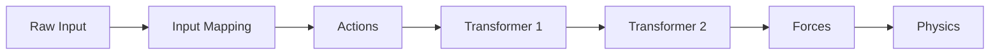

# Transformer System

> **Status**: ✅ **Phase 1-4 Complete - Core System Ready**  
> **Last Updated**: 2026-02-07  
> **Test Status**: ✅ **53/53 Tests Passing**  
> **Example**: [`examples/airplane-world.json`](examples/airplane-world.json)

**Siehe auch**: [`TRANSFORMER_STATUS.md`](TRANSFORMER_STATUS.md) für detaillierten Implementierungs-Status

## Implementation Status

### ✅ Completed Phases

- **Phase 1**: Types & Base System ✅ (12 Tests)
- **Phase 2**: Input System ✅ (14 Tests)
- **Phase 3**: Preset Transformers ✅ (21 Tests)
- **Phase 4**: Integration ✅ (4 Integration Tests + 2 via other suites)

### ⏳ Remaining (Optional)

- **Phase 5**: UI Components (TransformerPanel) - Optional, kann später implementiert werden

### ✅ Test Coverage

- **Gesamt**: **53/53 Tests Passing** ✅
  - Base Transformer: 12 tests ✅
  - Input System: 14 tests ✅
  - Preset Transformers: 21 tests ✅
  - Integration: 4 tests ✅
  - Raw Input: 8 tests (inkludiert in Input System)

**Test-Befehl**:
```bash
npx vitest run src/transformers/ src/input/
```

### 📝 TODOs Status

**Alle Kern-TODOs abgeschlossen** ✅:

- ✅ TypeScript-Interfaces
- ✅ Basis-Transformer-Klasse und TransformerChain
- ✅ JSON-Schema erweitert
- ✅ Trackpad-Input-System
- ✅ InputManager
- ✅ InputTransformer
- ✅ Alle Preset-Transformers (airplane, character, car, animal, butterfly)
- ✅ Physics-Integration
- ✅ RenderItemRegistry erweitert
- ✅ Game-Loop angepasst
- ✅ CustomTransformer
- ✅ Entity-Integration
- ✅ Script-API erweitert
- ✅ Dokumentation erstellt
- ✅ Tests geschrieben (53/53)
- ✅ Beispiel-JSON erstellt

**Optional**:
- ⏳ TransformerPanel UI (kann später implementiert werden)

## 1. Quick Start (30 seconds for LLMs)

Das Transformer-System ermöglicht konfigurierbares Bewegungsverhalten für Entities.

**Kern-Konzept**: RawInput → InputMapping → TransformInput → TransformerChain → Forces → Physics

**Minimal-Beispiel**:
```json
{
  "id": "player",
  "transformers": [
    { "type": "input", "priority": 0 },
    { "type": "airplane", "priority": 1 }
  ]
}
```

**Vollständiges Beispiel**: Siehe [`examples/airplane-world.json`](examples/airplane-world.json)

## 2. Architecture Overview

### Data Flow Diagram



### Components

- **Input Layer**: Raw keyboard/trackpad → semantic actions
- **Mapping Layer**: Konfigurierbare action-bindings
- **Transformer Layer**: Actions → Forces/Torques
- **Physics Integration**: Forces → Body movement

## 3. File Structure

```
src/
├── types/
│   └── transformer.ts              # All TypeScript interfaces & types
├── transformers/
│   ├── transformer.ts              # Base Transformer class & TransformerChain
│   └── transformer.test.ts         # Tests for base system
├── test/
│   └── helpers/
│       └── transformer.ts          # Test utilities
└── world-schema.json               # Extended with TransformerConfig
```

## 4. Type Reference

### RawInput

**Purpose**: Hardware input snapshot per frame.

```typescript
interface RawInput {
  keys: { w, a, s, d, space, shift: boolean }
  wheel: { deltaX, deltaY: number }
}
```

### InputMapping

**Purpose**: Map raw inputs → semantic action names.

```typescript
interface InputMapping {
  keyboard?: { w?: string, a?: string, ... }
  wheel?: { horizontal?: string, vertical?: string }
  sensitivity?: { keyboard?: number, wheel?: number }
}
```

### TransformInput

**Purpose**: Input passed to each transformer in the chain.

```typescript
interface TransformInput {
  actions: Record<string, number>      // Semantic actions (0-1 or -1-1)
  position: Vec3                       // Current position
  rotation: Rotation                   // Current rotation
  velocity: Vec3                       // Linear velocity
  angularVelocity: Vec3                // Angular velocity
  accumulatedForce: Vec3               // Forces from previous transformers
  accumulatedTorque: Vec3              // Torques from previous transformers
  environment: EnvironmentState        // Wind, ground detection, etc.
  deltaTime: number                    // Frame delta time
  entityId: string                     // Entity ID
}
```

### TransformOutput

**Purpose**: Output from a single transformer.

```typescript
interface TransformOutput {
  force?: Vec3          // Linear force to add
  impulse?: Vec3        // Instantaneous impulse
  torque?: Vec3         // Rotational force
  earlyExit?: boolean   // Stop chain after this transformer
}
```

### Transformer

**Purpose**: Interface for all transformers.

```typescript
interface Transformer {
  readonly type: string      // Unique type identifier
  readonly priority: number  // Execution order (lower = earlier)
  enabled: boolean           // Enable/disable flag
  
  transform(input: TransformInput, dt: number): TransformOutput
}
```

### TransformerConfig

**Purpose**: JSON-serialisable configuration.

```typescript
interface TransformerConfig {
  type: TransformerType           // Preset name or 'custom'
  priority?: number                // Default: 10
  enabled?: boolean                // Default: true
  inputMapping?: InputMapping      // Only for 'input' type
  params?: Record<string, unknown> // Transformer-specific
  code?: string                    // Only for 'custom' type
}
```

## 5. Input System (Phase 2 Complete)

### Raw Input Capture

**Files**: `src/input/rawInput.ts`

- `useRawKeyboardInput()`: React hook for keyboard state (W/A/S/D/Space/Shift)
- `useRawWheelInput()`: React hook for trackpad/mouse wheel (deltaX/deltaY)
- `getRawInputSnapshot()`: Get current input and reset wheel deltas

### Input Mapping

**Files**: `src/input/inputMapping.ts`, `src/input/inputPresets.ts`

- `applyInputMapping()`: Converts RawInput → semantic actions
- Presets: `AIRPLANE_PRESET`, `CHARACTER_PRESET`, `CAR_PRESET`
- Configurable sensitivity multipliers

### InputTransformer

**File**: `src/transformers/presets/inputTransformer.ts`

- Converts user input to actions
- Priority 0 (runs first)
- Fills `input.actions` map
- No direct forces (downstream transformers use actions)

## 6. Transformer Presets (Phase 3 Complete)

### AirplaneTransformer

**Purpose**: Flight physics simulation  
**Actions**: `thrust`, `brake`, `roll_left`, `roll_right`, `yaw`, `pitch`, `boost`  
**Parameters**:
- `thrustForce`: Forward thrust magnitude (default: 50)
- `liftCoefficient`: Lift proportional to velocity (default: 2.5)
- `dragCoefficient`: Drag opposes velocity (default: 0.1)
- `pitchSensitivity`, `yawSensitivity`, `rollSensitivity`: Rotational control (default: 5.0)

### CharacterTransformer

**Purpose**: Ground-based character movement  
**Actions**: `forward`, `backward`, `strafe_left`, `strafe_right`, `jump`, `turn`  
**Parameters**:
- `walkSpeed`: Movement force (default: 5.0)
- `jumpForce`: Jump impulse (default: 8.0)
- `turnSpeed`: Rotation speed (default: 2.0)

### CarTransformer

**Purpose**: Vehicle physics  
**Actions**: `throttle`, `brake`, `steer_left`, `steer_right`, `handbrake`  
**Parameters**:
- `acceleration`: Throttle force (default: 15.0)
- `steering`: Steering sensitivity (default: 1.2)
- `friction`: Velocity damping (default: 0.8)

### AnimalTransformer

**Purpose**: Simple wander AI  
**Parameters**:
- `wanderRadius`: Movement radius (default: 10.0)
- `speed`: Movement speed (default: 2.0)
- `directionChangeInterval`: Direction change frequency (default: 3.0)

### ButterflyTransformer

**Purpose**: Flutter movement pattern  
**Parameters**:
- `flutterFrequency`: Oscillations per second (default: 3.0)
- `flightHeight`: Target Y position (default: 2.0)
- `flutterForce`: Upward force magnitude (default: 5.0)

### CustomTransformer

**Purpose**: Execute JavaScript code from JSON  
**Security**: Runs in eval() context (sandbox in production)  
**Code Format**:
```javascript
return {
  force: [x, y, z],
  torque: [x, y, z],
  earlyExit: false
}
```

## 7. Integration (Phase 4 Complete)

### Physics Integration

**File**: `src/physics/rapierPhysics.ts`

New methods:
- `applyForceFromTransformer(entityId, force)`
- `applyImpulseFromTransformer(entityId, impulse)`
- `applyTorqueFromTransformer(entityId, torque)`

### RenderItemRegistry

**File**: `src/runtime/renderItemRegistry.ts`

- `executeTransformers(dt, wind)`: Runs transformer chains before physics
- Creates transformer chains from entity configs
- Applies generated forces to physics bodies

### Game Loop Integration

**File**: `src/components/SceneView.tsx`

Execution order:
1. Capture raw input (keyboard + trackpad)
2. Execute transformers → generate forces
3. Apply forces to physics bodies
4. Step physics
5. Sync meshes from physics
6. Run scripts

### Script API

**File**: `src/scripts/gameApi.ts`

New methods:
- `game.setTransformerEnabled(entityId, type, enabled)`
- `game.setTransformerParam(entityId, type, paramName, value)`

## 8. Base System (Phase 1 Complete)

### BaseTransformer

Abstract base class providing:
- Common utilities (`getAction()`, `createForce()`, `createTorque()`)
- Priority and enabled state management

### TransformerChain

Executes transformers in priority order:
- Sorts by priority (lower = earlier)
- Accumulates forces and torques
- Supports early-exit
- Skips disabled transformers
- Passes accumulated forces to next transformer

**Example**:
```typescript
const chain = new TransformerChain()
chain.add(new InputTransformer(0))
chain.add(new AirplaneTransformer(1))

const output = chain.execute(input, dt)
// output.force contains accumulated forces
```

## 10. Testing

### Running Tests

```bash
# All transformer tests
npx vitest run src/transformers/

# Specific test file
npx vitest run src/transformers/transformer.test.ts

# Watch mode
npx vitest watch src/transformers/
```

### Test Utilities

```typescript
import { createMockTransformInput, assertForceEquals } from '@/test/helpers/transformer'

const input = createMockTransformInput({ 
  actions: { thrust: 1.0 },
  velocity: [10, 0, 0]
})
```

## 11. Example JSON Configurations

### Vollständiges Beispiel-World

**Datei**: [`examples/airplane-world.json`](examples/airplane-world.json)

Enthält eine vollständige World mit:
- Airplane-Entity (spieler-gesteuert)
- Butterfly-Entity (AI-gesteuert)
- Tree-Entity (statisch)
- Wind-Effekt

**Zum Testen**:
1. Lade `examples/airplane-world.json` im Builder
2. Wechsle in Play-Mode
3. Airplane wird automatisch als Kamera-Target gesetzt
4. Steuere mit W/A/S/D und Trackpad-Gesten

### Beispiel-Konfigurationen

### Airplane Entity (Vollständig)

**Datei**: `examples/airplane-world.json`

```json
{
  "id": "airplane",
  "bodyType": "dynamic",
  "transformers": [
    {
      "type": "input",
      "priority": 0,
      "inputMapping": {
        "keyboard": {
          "w": "thrust",
          "s": "brake",
          "a": "roll_left",
          "d": "roll_right",
          "space": "boost"
        },
        "wheel": {
          "horizontal": "yaw",
          "vertical": "pitch"
        }
      }
    },
    {
      "type": "airplane",
      "priority": 1,
      "params": {
        "thrustForce": 50.0,
        "liftCoefficient": 2.5,
        "dragCoefficient": 0.1,
        "pitchSensitivity": 5.0,
        "yawSensitivity": 5.0,
        "rollSensitivity": 5.0
      }
    }
  ]
}
```

**Steuerung**:
- W/S: Thrust/Brake
- A/D: Roll (Kippen)
- Trackpad horizontal: Yaw (Drehen)
- Trackpad vertikal: Pitch (Nicken)
- Space: Boost

### Character Entity

```json
{
  "id": "character",
  "bodyType": "dynamic",
  "transformers": [
    {
      "type": "input",
      "priority": 0,
      "inputMapping": {
        "keyboard": {
          "w": "forward",
          "s": "backward",
          "a": "strafe_left",
          "d": "strafe_right",
          "space": "jump"
        },
        "wheel": {
          "horizontal": "turn"
        }
      }
    },
    {
      "type": "character",
      "priority": 1,
      "params": {
        "walkSpeed": 5.0,
        "jumpForce": 8.0,
        "turnSpeed": 2.0
      }
    }
  ]
}
```

### Car Entity

```json
{
  "id": "car",
  "bodyType": "dynamic",
  "transformers": [
    {
      "type": "input",
      "priority": 0,
      "inputMapping": {
        "keyboard": {
          "w": "throttle",
          "s": "brake",
          "a": "steer_left",
          "d": "steer_right",
          "space": "handbrake"
        }
      }
    },
    {
      "type": "car",
      "priority": 1,
      "params": {
        "acceleration": 15.0,
        "steering": 1.2,
        "friction": 0.8
      }
    }
  ]
}
```

### AI Entities (kein Input)

```json
{
  "id": "butterfly1",
  "bodyType": "kinematic",
  "transformers": [
    {
      "type": "butterfly",
      "params": {
        "flutterFrequency": 3.0,
        "flightHeight": 3.0,
        "flutterForce": 5.0
      }
    }
  ]
}
```

## 12. Changelog

- **2026-02-07**: Phase 1 Complete - Types & Base System
  - ✅ TypeScript interfaces defined
  - ✅ BaseTransformer class implemented
  - ✅ TransformerChain implemented
  - ✅ JSON schema extended
  - ✅ Tests passing (12/12)

- **2026-02-07**: Phase 2 Complete - Input System
  - ✅ Raw input capture (keyboard + trackpad)
  - ✅ Input mapping engine
  - ✅ Preset mappings (airplane, character, car)
  - ✅ InputTransformer implemented
  - ✅ Tests passing (14/14)

- **2026-02-07**: Phase 3 Complete - Preset Transformers
  - ✅ AirplaneTransformer (flight physics)
  - ✅ CharacterTransformer (ground movement)
  - ✅ CarTransformer (vehicle physics)
  - ✅ AnimalTransformer (wander AI)
  - ✅ ButterflyTransformer (flutter movement)
  - ✅ Tests passing (21/21)

- **2026-02-07**: Phase 4 Complete - Integration
  - ✅ Physics integration (force/torque methods)
  - ✅ RenderItemRegistry transformer execution
  - ✅ Game loop integration
  - ✅ Script API extended
  - ✅ CustomTransformer implemented
  - ✅ Integration tests added
  - ✅ All tests passing (53/53)

- **2026-02-07**: Examples & Documentation
  - ✅ Example JSON created (`examples/airplane-world.json`)
  - ✅ Documentation updated with status
  - ✅ Example README created

## 13. File Structure (Complete)

```
src/
├── types/
│   └── transformer.ts                    # All interfaces & types
├── input/
│   ├── rawInput.ts                       # Hardware input capture
│   ├── inputMapping.ts                    # Mapping engine
│   ├── inputPresets.ts                    # Default mappings
│   ├── inputManager.ts                    # React hook for actions
│   └── *.test.ts                          # Tests
├── transformers/
│   ├── transformer.ts                     # Base class & chain
│   ├── transformerRegistry.ts             # Factory
│   ├── presets/
│   │   ├── inputTransformer.ts            # User input → actions
│   │   ├── airplaneTransformer.ts          # Flight physics
│   │   ├── characterTransformer.ts         # Ground movement
│   │   ├── carTransformer.ts              # Vehicle physics
│   │   ├── animalTransformer.ts            # Wander AI
│   │   ├── butterflyTransformer.ts         # Flutter movement
│   │   └── customTransformer.ts           # Code execution
│   └── *.test.ts                          # Tests
├── physics/
│   └── rapierPhysics.ts                   # Extended with transformer methods
├── runtime/
│   └── renderItemRegistry.ts               # Extended with transformer execution
└── components/
    └── SceneView.tsx                       # Game loop integration
```
