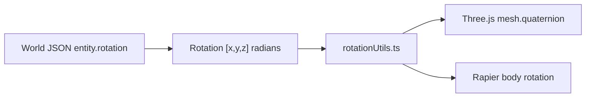

# Direction / rotation coordinates

How orientation is represented in world data, the inspector, and the script API.

---

## Stored format

- **Rotation** is **Euler angles** as a 3-element array: `[x, y, z]`. Three numbers are enough to point an object in any direction.
- **Unit:** **Radians** (not degrees). One full turn = `2 * Math.PI` (~6.283). Examples: `0` = 0°, `Math.PI / 2` ≈ 1.57 = 90°, `Math.PI` ≈ 3.14 = 180°.
- **Range:** The schema does not constrain min/max; values are any real number. Typical use: `0` to `2π` or `-π` to `π` per axis.
- **Order:** Rotations are applied in **XYZ** order (see `src/utils/rotationUtils.ts`, `THREE.Euler(..., 'XYZ')`).

**Where used:** World JSON (`entity.rotation`, `world.camera.defaultRotation`), types in `src/types/world.ts` (`Rotation`), script API (`getRotation` / `setRotation`), inspector (TransformEditor via Vec3Field). Conversion layer: `src/utils/rotationUtils.ts` and `src/runtime/renderItem.ts`.

Internally, Three.js meshes and Rapier bodies use **quaternions**; conversion happens at the boundaries (Euler ↔ quaternion) so the document and script API stay Euler.

---

## Data flow

---

## Caveats and disadvantages

1. **Inspector editing:** The rotation fields in the inspector show **live** pose: each frame the runtime reads the body’s quaternion, converts to Euler, and displays that. So:
   - Editing one axis can make the displayed triple “jump” to another valid Euler representation (same orientation, different numbers).
   - To snap to no rotation reliably, use **Reset rotation** (button next to Rotation in the transform editor); it sets the runtime to identity and writes `[0, 0, 0]`.
2. **Detecting orientation in scripts:** Use **`ctx.detect`** (e.g. `ctx.detect.isUpsideDown()`, `ctx.detect.isLyingOnSide()`). These use world **+Y up** and **-Z forward** and avoid raw Euler. Do not compare Euler components. See `feature-scripting.md` for the full `ctx.detect` API.

See also: `world-schema.json` (`Rotation` def), `feature-scripting.md` (script API and ctx.detect).
