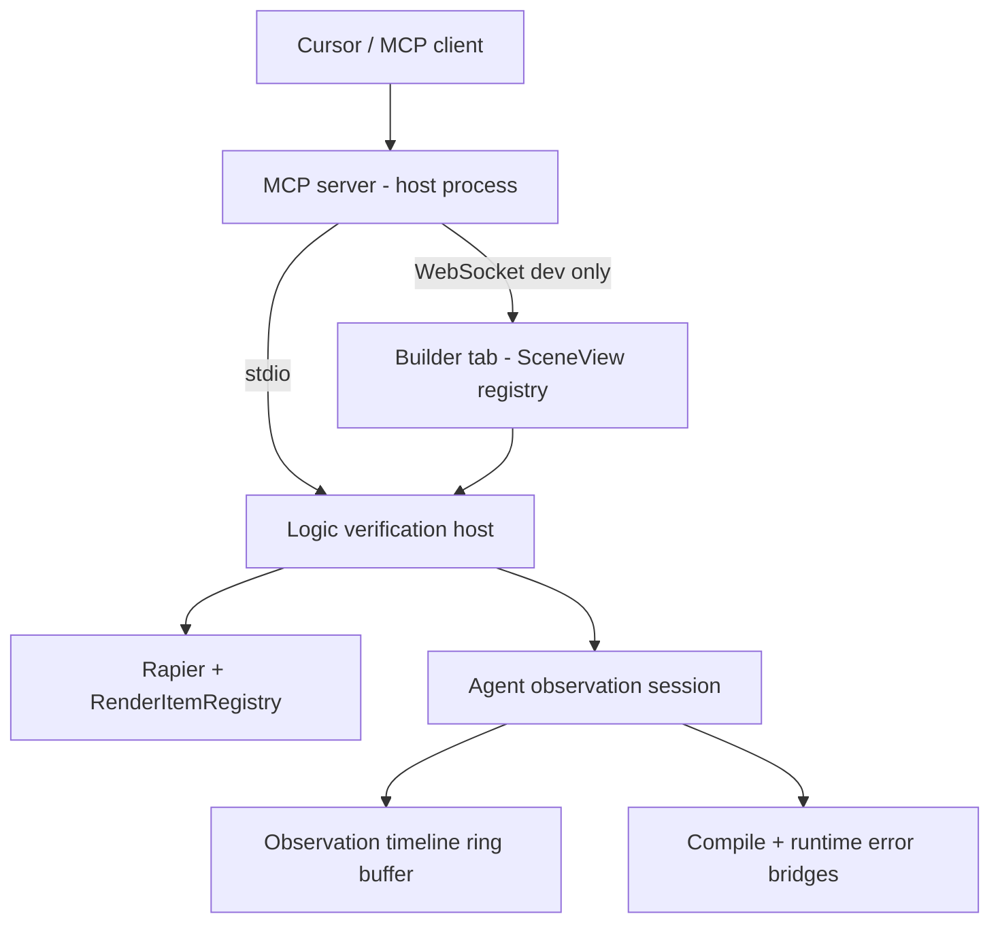

# Agent logic verification — design spec

How an external agent **authors transformer logic**, **runs** the sim, and **reads feedback** (data, not pixels)—aligned with [feature-coding-custom-transformers.md](./feature-coding-custom-transformers.md) and [feature-world-update-reload.md](./feature-world-update-reload.md). Glossary: root [CONTEXT.md](../CONTEXT.md). ADR: [docs/adr/0001-logic-verification-host.md](../docs/adr/0001-logic-verification-host.md).

---

## Goals

- Agent **never clicks** Builder UI; it applies **document patches** and imperative scene ops through a stable API.
- **Preserve live poses** on pose-safe edits (same class as `syncEntityTransformers` / incremental sync). **Reset** only when the agent asks.
- **Deterministic** verification runs by default (fixed `dt`, scripted `RawInput`).
- Agent **controls what to observe**: **platform probes** (registry) + **author telemetry** (`api.watch` and existing error/trace bridges).
- **Headless** for fast program–run–fix and CI; **browser** for one sim with human-visible canvas + same observation stream over MCP.

---

## Architecture

| Piece | Responsibility |
|--------|----------------|
| **Logic verification host** | Load world (+ assets fixture), `validate` / `apply` patches, run N steps or T sim seconds, manage observation session |
| **Agent observation session** | Enable watch/trace publishing without Workspace gate; run platform probes on intervals; append to timeline |
| **MCP server** | Thin tools → host; no physics inside MCP |
| **Browser attach** | Same host API; Builder delegates stepping or mirrors registry state (implementation detail in a later PR) |

v1 fixture: pinned **self-driving car** world in repo (JSON + scripted throttle/steer).

---

## Apply path (pose-safe by default)

| Patch kind | Expected behavior | Notes |
|------------|-------------------|--------|
| Custom stage `code`, `params`, enable, order | Pose-safe | Reuse `syncEntityTransformers` / `handleEntityTransformersChange` seam |
| Entity `scripts` | Pose-safe if incremental sync allows | Classify per rebuild key |
| Add/remove entity, trimesh/model structural | May require scene runtime restart | Require `allowSceneRebuild: true`; optional `capturePoses` / `restorePoses` |
| World gravity, etc. | Often incremental effect | Document per [feature-world-update-reload.md](./feature-world-update-reload.md) |

**Tool flow:** `validate_stage_code` → `apply_world_patch` → `start_verification_run` → `step` / `run_for_sim_time` → `get_observation` / `stop_run`. For timed input sequences (car maneuvers, staged throttle/steer), prefer **`run_timed_macro`** (one call → macro log). ADR: [0004-timed-verification-macro.md](../docs/adr/0004-timed-verification-macro.md).

Compile: `validateCustomTransformerSource` before apply. Runtime: existing `customTransformerErrorBridge`. Schema/load: surface Ajv/migrate warnings in run metadata.

---

## Observation model (layered)

**Platform probes** (agent registers per run):

| Probe kind | Source (conceptual) |
|------------|---------------------|
| `entityPose` | Registry / physics position & rotation |
| `entityBody` | Rapier linvel, angvel, sleeping, … |
| `action` | Resolved action values for traced entity |
| `trace` | `transformerTraceBridge` steps for entity |
| `watchLabels` | Subscribe to `transformerWatchBridge` entries (author telemetry) |

**Author telemetry:** existing `api.watch(label, value)` — string formatted via `formatWatchValue`; requires observation session enabled (not Workspace UI).

**Timeline:** each row `{ simTime, dt, rows: { probeId \| label → value } }`; cap length (e.g. 500–2000); cleared on new run unless agent registers `carryOver`.

Errors/warnings attached to run handle: compile (pre-apply), runtime (per target), load warnings (on world load).

---

## Run modes

| Mode | When | Human sees canvas |
|------|------|-------------------|
| **Headless** | CI, agent tight loop | No |
| **Browser-attached** | Interactive debugging | Yes — same run, MCP reads timeline |

Avoid running two sims for one edit (headless + browser in parallel) unless replay files exist later.

---

## MCP tools (v1 sketch)

| Tool | Purpose |
|------|---------|
| `load_world_json` | Inline world JSON (headless) |
| `load_fixture` | Pinned repo fixture by id (headless) |
| `load_project_bundle` | On-disk agent project bundle by id (headless, Node) |
| `validate_stage_code` | Compile check only |
| `apply_world_patch` | Transformer registry + `entities` add/update/remove; `allowSceneRebuild` for structural edits |
| `export_project_bundle` | Write headless world JSON to allowlisted bundle path (after `load_project_bundle`) |
| `register_probes` | Probe list + intervals |
| `start_verification_run` | Input script, duration or max steps, seed |
| `run_for_sim_time` | Deterministic advance |
| `run_timed_macro` | Sim-time input schedule + optional probe samples; returns macro log |
| `get_observation` | Timeline slice, latest errors, watch snapshot |
| `stop_run` | End session, optional export JSON |
| `attach_browser` | Dev: connect to open Builder tab (WebSocket bridge) |

Transport: MCP process on host; browser bridge on `127.0.0.1` + token (dev only). With `npm run dev`, Vite starts the bridge; Builder reconnects automatically. Set matching `VITE_RENN_MCP_DEV_TOKEN` (and optional `VITE_RENN_MCP_BROWSER_PORT`) in `.env.local` for the browser tab.

### Cursor MCP (dev)

Copy `.cursor/mcp.json.example` to `.cursor/mcp.json`, set `cwd` to your repo root, keep `RENN_MCP_DEV_TOKEN`. Start the server via Cursor MCP panel; tools require `devToken` matching that env var. Do not enable in production builds.

---

## Implementation order (suggested)

1. **Done (slice 1):** `src/agent/logicVerificationHost.ts` — headless load, scripted `RawInput`, step loop, poses + sim time. Test: `src/test/scenarios/logic-verification-host.integration.test.ts`. Test harness `WorldSimulator` still wraps the same stack; migrate to host when convenient.
2. **Done (slice 2):** `src/agent/agentObservationSession.ts` — `setAgentObservationWatchActive` / trace entity ids lift Builder gates when session active; platform probes (`entityPose`, `entityBody`, `trace`); capped timeline; compile errors on session, runtime via error bridge. Wired in `logicVerificationHost.ts` (`registerObservationProbes`, `startObservationRun`, `getObservationTimeline`). Tests: `agentObservationSession.test.ts`, `agent-observation-session.integration.test.ts`.
3. **Done (slice 3):** `src/agent/applyLogicVerificationWorldPatch.ts` + `LogicVerificationHost.applyWorldPatch` — transformer registry patches, compile validation, `setWorldPipeRegistry` + `syncEntityTransformers` + awaited chain resync. Test: `logic-verification-pose-safe-apply.integration.test.ts`. MCP `apply_world_patch` wired.
4. **Done (slice 4):** Pinned car world `src/agent/fixtures/agentVerificationCarWorld.json` + loader `src/agent/fixtures/agentVerificationCarWorld.ts` (scripted throttle/steer). Test: `src/test/scenarios/agent-car-verification.integration.test.ts` (timeline + motion/speed after N sim seconds, compile error path). Host/MCP integration tests reuse the fixture.
5. **Done (slice 5 — thin MCP):** `tools/renn-mcp/stdio.ts` + `src/agent/logicVerificationMcpServer.ts` — stdio MCP tools → headless host; dev token via `RENN_MCP_DEV_TOKEN`. Cursor example: `.cursor/mcp.json.example`. Test: `logic-verification-mcp.integration.test.ts`.
6. **Done (slice 6 — browser attach v1.1):** Dev-only localhost WebSocket bridge (`logicVerificationBrowserBridgeServer.ts`, Vite plugin `logicVerificationBrowserBridgeVitePlugin.ts`, default port `9234` / `RENN_MCP_BROWSER_PORT`). Open Builder (`SceneView` → `useLogicVerificationBrowserAttach`) adopts live registry + physics via `LogicVerificationHost.adoptLiveScene` and serves the same RPC surface as headless. MCP `attach_browser` proxies through `LogicVerificationBrowserMcpClient`. Exclusive stepping (`logicVerificationExclusiveStepping.ts`) pauses rAF sim during MCP `run_steps` / `run_for_sim_time`. Test: `logic-verification-browser-attach.integration.test.ts`. **`load_fixture`** MCP tool via `logicVerificationFixtures.ts` (`agentVerificationCarWorld`).
7. **Done (slice 7 — authoring setup):** On-disk **agent project bundles** under `src/agent/projects/` (`agent-starter`), `loadAgentProjectBundle`, MCP `load_project_bundle`, `npm run agent:setup-check`. Tests: `loadAgentProjectBundle.test.ts`, `agent-project-bundle.integration.test.ts`. Workflow doc: [feature-agent-authoring-setup.md](./feature-agent-authoring-setup.md). ADR: [0002-agent-project-bundle-on-disk.md](../docs/adr/0002-agent-project-bundle-on-disk.md).
8. **Done (slice 8 — MCP architecture seams):** Shared `prepareWorldForLogicVerification`, `logicVerificationProjectSource` (fixture / bundle / inline), optional bundle `assets` on host create, `logicVerificationRunController` (+ in-process / browser RPC backends), shared browser RPC loop, bridge transport-only relay (dead `invokeBrowserRpc` removed). MCP load tools remain thin aliases.
9. **Done (slice 9 — timed macro):** `run_timed_macro` MCP + browser RPC; `src/agent/timedVerificationMacro.ts` (config validation, sim-time input script, optional `segmentWallPauseMs` on attach). Tests: `timedVerificationMacro.test.ts`, MCP integration.

### `run_timed_macro` config (v1)

| Field | Meaning |
|--------|---------|
| `startDelaySimSec` | Advance sim with `holdInputDuringDelay` (default empty) before schedule |
| `durationSimSec` | Sim seconds after delay (cap 120s total with delay) |
| `steps[]` | `{ atSimTime, inputKeys? }` — macro-relative; latest step at or before macro time wins |
| `samples[]` | Inline platform probes (`entityPose`, `entityBody`, `trace`) with optional `intervalMs` |
| `segmentWallPauseMs` | Attached Builder only: pause after each input-step boundary for human-visible pacing |
| `carryOverTimeline` | Same as `start_verification_run` |

**Macro log:** `{ macroStartSimTime, endedSimTime, events[], timeline[], snapshot, compileErrors, runtimeErrorList }`.

---

## Out of scope (v1)

- Pixel/visual assertions (use human browser or future replay).
- Arbitrary eval in agent API.
- Production-enabled MCP in shipped builds.

---

## Slice 4 notes (L2)

- Fixture lives under `src/agent/fixtures/` (shared by Vitest + MCP), not `src/test/fixtures/`: JSON includes `car_telemetry_tf` custom stage with `api.watch('speedZ', …)` for author-telemetry rows on the observation timeline.
- Loader exports `loadAgentVerificationCarWorld`, `buildAgentCarDriveInputScript`, warmup/drive constants; host + MCP integration tests import the same module.
- Primary scenario: `agent-car-verification.integration.test.ts` — 2 s scripted drive, `entityPose` / `entityBody` probes, compile-error path, idle-without-throttle guard.
