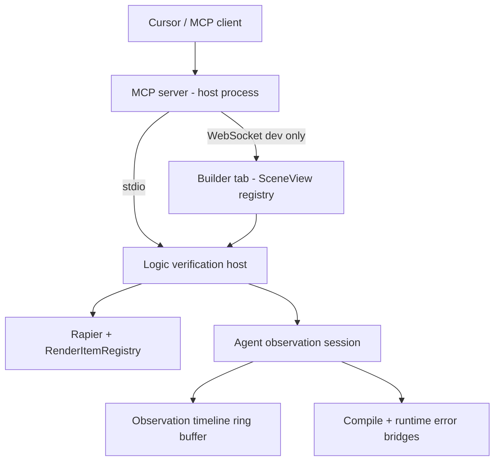

# Agent logic verification — design spec

How an external agent **authors transformer logic**, **runs** the sim, and **reads feedback** (data, not pixels)—aligned with [feature-coding-custom-transformers.md](./feature-coding-custom-transformers.md) and [feature-world-update-reload.md](./feature-world-update-reload.md). Glossary: root [CONTEXT.md](../CONTEXT.md). ADR: [docs/adr/0001-logic-verification-host.md](../docs/adr/0001-logic-verification-host.md).

---

## Goals

- Agent **never clicks** Builder UI; it applies **document patches** and imperative scene ops through a stable API.
- **Preserve live poses** on pose-safe edits (same class as `syncEntityTransformers` / incremental sync). **Reset** only when the agent asks.
- **Deterministic** verification runs by default (fixed `dt`, scripted `RawInput`).
- Agent **controls what to observe**: **platform probes** (registry) + **author telemetry** (`api.watch` and existing error/trace bridges).
- **Headless** for fast program–run–fix and CI; **browser** for one sim with human-visible canvas + same observation stream over MCP.

---

## Architecture

| Piece | Responsibility |
|--------|----------------|
| **Logic verification host** | Load world (+ assets fixture), `validate` / `apply` patches, run N steps or T sim seconds, manage observation session |
| **Agent observation session** | Enable watch/trace publishing without Workspace gate; run platform probes on intervals; append to timeline |
| **MCP server** | Thin tools → host; no physics inside MCP |
| **Browser attach** | Same host API; Builder delegates stepping or mirrors registry state (implementation detail in a later PR) |

v1 fixture: pinned **self-driving car** world in repo (JSON + scripted throttle/steer).

---

## Apply path (pose-safe by default)

| Patch kind | Expected behavior | Notes |
|------------|-------------------|--------|
| Custom stage `code`, `params`, enable, order | Pose-safe | Reuse `syncEntityTransformers` / `handleEntityTransformersChange` seam |
| Entity `scripts` | Pose-safe if incremental sync allows | Classify per rebuild key |
| Add/remove entity, trimesh/model structural | May require scene runtime restart | Require `allowSceneRebuild: true`; optional `capturePoses` / `restorePoses` |
| World gravity, etc. | Often incremental effect | Document per [feature-world-update-reload.md](./feature-world-update-reload.md) |

**Tool flow:** `validate_stage_code` → `apply_world_patch` → `start_verification_run` → `step` / `run_for_sim_time` → `get_observation` / `stop_run`.

Compile: `validateCustomTransformerSource` before apply. Runtime: existing `customTransformerErrorBridge`. Schema/load: surface Ajv/migrate warnings in run metadata.

---

## Observation model (layered)

**Platform probes** (agent registers per run):

| Probe kind | Source (conceptual) |
|------------|---------------------|
| `entityPose` | Registry / physics position & rotation |
| `entityBody` | Rapier linvel, angvel, sleeping, … |
| `action` | Resolved action values for traced entity |
| `trace` | `transformerTraceBridge` steps for entity |
| `watchLabels` | Subscribe to `transformerWatchBridge` entries (author telemetry) |

**Author telemetry:** existing `api.watch(label, value)` — string formatted via `formatWatchValue`; requires observation session enabled (not Workspace UI).

**Timeline:** each row `{ simTime, dt, rows: { probeId \| label → value } }`; cap length (e.g. 500–2000); cleared on new run unless agent registers `carryOver`.

Errors/warnings attached to run handle: compile (pre-apply), runtime (per target), load warnings (on world load).

---

## Run modes

| Mode | When | Human sees canvas |
|------|------|-------------------|
| **Headless** | CI, agent tight loop | No |
| **Browser-attached** | Interactive debugging | Yes — same run, MCP reads timeline |

Avoid running two sims for one edit (headless + browser in parallel) unless replay files exist later.

---

## MCP tools (v1 sketch)

| Tool | Purpose |
|------|---------|
| `load_fixture` / `load_world_json` | Start from car fixture or inline world |
| `validate_stage_code` | Compile check only |
| `apply_world_patch` | JSON patch; flags `allowSceneRebuild`, `resetPoses` |
| `register_probes` | Probe list + intervals |
| `start_verification_run` | Input script, duration or max steps, seed |
| `run_for_sim_time` | Deterministic advance |
| `get_observation` | Timeline slice, latest errors, watch snapshot |
| `stop_run` | End session, optional export JSON |
| `attach_browser` | Dev: connect to open Builder tab (optional v1.1) |

Transport: MCP process on host; browser bridge on `127.0.0.1` + token (dev only).

---

## Implementation order (suggested)

1. Extract **logic verification host** from existing integration test setup (`RenderItemRegistry`, `createPhysicsWorld`, scripted input).
2. **Agent observation session** module: lift Workspace gates on watch/trace; add probe scheduler + ring buffer.
3. **Pose-safe apply** wrapper calling same paths as `useBuilderEntityWorldActions` / `SceneView.syncEntityTransformers`.
4. Vitest **car fixture** scenario asserting timeline + error paths.
5. MCP server wrapping (3)–(4).
6. Builder WebSocket attach for dual-audience runs.

---

## Out of scope (v1)

- Pixel/visual assertions (use human browser or future replay).
- Arbitrary eval in agent API.
- Production-enabled MCP in shipped builds.
