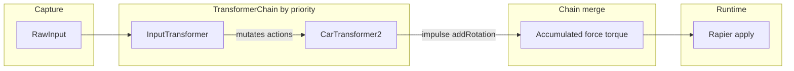

# Transformers

Transformers convert high-level intent (input, AI, waypoints) into physics impulses or pose commands. They do not call physics APIs directly from `transform()`; the runtime applies `TransformOutput` after the chain runs.

## Target intent vs movement execution

| Layer | Responsibility |
|--------|------------------|
| **Target sources** (`targetPoseInput`, `wanderer`, `follow`, future AI/script) | **Where** to go: `TransformInput.target` with `pose`, **linear** `speed` (m/s average along translation toward `pose.position`), optional `curve` / `velocity`. Does **not** specify kinematic vs dynamic vs forces. |
| **Movement transformers** (`kinematicMovement`, future force-based movers) | **How** to realize intent: read `input.target` and emit forces or `setPose` as designed. |

**Paradigms**

- **`target.speed`** is **linear only** (m/s). It is **not** angular rate and **not** a primary duration knob; segment time is **emergent** (≈ distance / speed for constant-speed translation).
- **Rotation** toward `target.pose.rotation` is **not** driven by `target.speed`; each movement transformer documents its own rotation policy (e.g. `kinematicMovement` uses slerp with `maxRotationRate`).

## Data flow

```
RawInput → InputMapping → TransformInput → TransformerChain → TransformOutput → Physics
```

- Transformers run in `priority` order (lower = earlier).
- **Forces and torques** are **additive**; `color`, `addRotation`, and `setPose` are **last-wins** in the chain.
- Target sources may **mutate** `TransformInput.target` each frame (last writer wins if multiple write).
- `TransformOutput.color` (optional [r,g,b] 0–1) is applied by the render loop via `setColor` for display feedback.
- `TransformOutput.addRotation` (optional Euler delta [x,y,z] rad): when set, the render loop **adds each component** to the current body Euler rotation, calls `physicsWorld.setRotation()`, then zeros angular velocity. Default is undefined so other transformers are unaffected.
- `TransformOutput.setPose` (optional full world pose): **kinematic** bodies use Rapier `setNextKinematicTranslation` / `setNextKinematicRotation` before the step so contacts with dynamic bodies get correct friction. **Dynamic** bodies: position/rotation are set and linear/angular velocity are zeroed; scripted pose on dynamic bodies may fight other forces.
- **`TransformInput.environment`** (filled by the runtime before the chain runs): `isTouchingObject` from narrow-phase contacts; when touching, optional **`supportVelocity`** — world-space linear velocity of contacting bodies averaged at solver contact points (`PhysicsWorld.getAverageSupportVelocity`). **`car2`** uses `input.velocity − supportVelocity` for forward speed (steering yaw), lateral grip, and lateral-to-forward transfer so motion on moving platforms matches motion relative to the surface. Omit `supportVelocity` when airborne or unknown (legacy behavior: world velocity only).
- `resetAllForces()` is called before each frame so forces never accumulate across frames. Rapier's `addForce()`/`addTorque()` are **persistent** — without reset, each frame's force stacks (N frames → N×F), causing unbounded angular velocity. Fix: `physicsWorld.resetAllForces()` at the start of each frame, before `executeTransformers()`. See `rapierPhysics.ts` and `renderItemRegistry.ts`.
- **Play avatars:** When the world defines at least one entity with `avatar` and play mode runs scripts + physics, **`InputTransformer`** only maps raw keyboard input for the **current avatar** entity id; other entities’ `input` transformers see empty `actions`. See [feature-scripting.md](feature-scripting.md) (Play avatars).

## Custom code (`type: "custom"`)

- **Builder:** Right sidebar **Code** drawer **Transformer code** subtab (middle segment between **Transformers** and **Scripts**): pick which `custom` row to edit by stack index (labeled with `name`, default `Custom` / `Custom 2`, …). **Transformers** subtab still shows the full stack (reorder, presets, JSON). Each custom row has optional serialised **`name`** (unique among `custom` entries on that entity); legacy worlds get names on load via `migrateCustomTransformerNames`.
- **Transformer code tab** features debounced live commit for Monaco, **Params (JSON)**, **Priority**, rename-on-blur, and an LED-style **enabled** toggle for the selected custom transformer. In **Workspace**, add a **custom** stage via the pipeline’s **+ Add** menu (no separate **Add custom** button).
- **Runtime:** `customCodeTransformer.ts` compiles the source **once** when the chain is built. The body runs as `function (input, dt, params, state, api) { … }` and must **`return`** a `TransformOutput` or `{}`. You may **mutate `input.actions`** (same pattern as the **`input`** preset) and return **`{}`** so a later **`car2`** / **`person`** stage consumes your semantic actions; order the custom row **after** `input` and **before** the movement preset. `state` is a per-instance mutable object. **`api`** is a frozen singleton (`getAction`, `getForwardVector`, `getUpVector`, `addVec3`, `scaleVec3`, `clamp`, `eulerDeltaAroundAxis`, **`raycast`**) so authors avoid import boilerplate in saved JSON. Non-finite outputs are stripped.
- **`api.raycast(origin, fwd, maxDistance?)`**: Cast a ray from a raw `Vec3` origin (typically `input.position`) in direction `fwd`. No entity is automatically excluded — offset the origin or filter `result.entityId` in code if needed. Returns `{ hit: boolean, distance: number, entityId: string }`. `maxDistance` defaults to 100. Returns no-hit when physics is unavailable or direction is zero-length. Example: `const r = api.raycast(input.position, api.getForwardVector(input.rotation), 15); if (r.hit) { return { force: api.scaleVec3(fwd, -200) } }`.
- **Performance:** Matches other transformers in engine overhead (no recompile per frame), but user code still runs every physics step per entity—keep it cheap; avoid per-frame allocations.
- **Synthetic actions:** mutating `input.actions` and returning `{}` (same pattern as the `input` preset) is documented with stack-order and timing notes in [feature-coding-custom-transformers.md](feature-coding-custom-transformers.md#recipe-synthetic-actions).

## Key files

```
src/
├── types/transformer.ts                      # All TS interfaces
├── transformers/
│   ├── transformerParamDocs.ts               # User-facing field descriptions (Builder tooltips)
│   ├── transformer.ts                        # BaseTransformer + TransformerChain
│   ├── transformerRegistry.ts                # Factory: type string → instance
│   ├── customCodeTransformer.ts              # type "custom": compile config.code once
│   ├── transformerCodeDecl.ts                # Monaco .d.ts for custom transformer authoring
│   ├── transformerPresets.ts                 # Default configs for Builder dropdown
│   └── presets/
│       ├── inputTransformer.ts               # Raw input → actions (priority 0)
│       ├── car2Transformer.ts               # Impulse + addRotation; slip/speed vs supportVelocity
│       ├── personTransformer.ts             # Walk/run + turn when grounded
│       ├── targetPoseInputTransformer.ts     # Waypoints → TransformInput.target
│       ├── wandererTransformer.ts            # Random poses in cube → TransformInput.target
│       ├── followTransformer.ts              # Another entity's pose → TransformInput.target
│       └── kinematicMovementTransformer.ts   # input.target → TransformOutput.setPose
├── data/transformerPresets/
│   ├── loader.ts                             # listPresetNames, loadPreset (from JSON files)
│   ├── car2/                                 # Optional .json templates
│   ├── input/                                # e.g. keyboard-car.json = car input (Space → jump for car2)
│   ├── person/
│   ├── targetPoseInput/
│   ├── wanderer/
│   ├── follow/
│   └── kinematicMovement/
├── input/
│   ├── rawInput.ts                           # Keyboard + trackpad capture
│   ├── inputMapping.ts                       # RawInput → semantic actions
│   └── inputPresets.ts                       # CHARACTER_PRESET, CAR_PRESET
├── physics/rapierPhysics.ts                  # applyForce/Impulse/TorqueFromTransformer
└── runtime/renderItemRegistry.ts             # executeTransformers() called in game loop
```

## Builder: `enabled` without scene reload

- Each transformer row has a green/red dot button that toggles the serialised `enabled` field immediately (not via the JSON Apply button).
- `getSceneDependencyKey` omits `enabled` from transformer configs so toggling does not trigger a full scene rebuild.
- `RenderItemRegistry.syncEntityTransformers` updates `item.entity.transformers` and sets `Transformer.enabled` on the live chain (same order as config). Builder calls it when the scene dependency key is unchanged after a transformers edit.

## Preset transformer reference

Templates live under `src/data/transformerPresets/<type>/*.json` and appear in the Builder transformer template dialog.

| Type | Purpose | Key params |
|---|---|---|
| `input` | Maps raw keys/wheel → actions | `inputMapping` (keyboard/wheel bindings) |
| `car2` | Impulse + addRotation for steering; optional **jump** (world-Y impulse once per press); **physics only when touching another object** | `power`, `steeringIntensity`, `steeringSpeed`, `lateralGrip`, `lateralToForwardTransfer`, `tireGripSlipSpeedThreshold`, `lateralGripSlipScale`, `jumpImpulse` |
| `person` | WASD walk/run + turn torque when grounded | `walkForce`, `runForce`, `maxWalkSpeed`, `maxRunSpeed`, `turnSpeed` |
| `targetPoseInput` | Waypoint list → **`TransformInput.target`** (pose + linear speed); modes `cycle`, `pingPong`, `stopAtEnd` | `poses`, `speed`, `mode`, `positionEpsilon`, `rotationEpsilon` |
| `wanderer` | Random poses within perimeter cube → **`TransformInput.target`**; configurable speed, jump distance, linear/angular toggles | `speed`, `jumpDistance`, `linear`, `angular`, `perimeter` (center, halfExtents), `positionEpsilon`, `rotationEpsilon` |
| `follow` | Each frame, copy another item's world pose into **`TransformInput.target`** (pose + linear `speed`); runtime resolves pose via `RenderItemRegistry` (physics cache + mesh fallback) | `targetEntityId`, `speed`, `linear`, `angular` |
| `kinematicMovement` | Reads **`input.target`**, emits **`setPose`** (linear move at `target.speed`, rotation via `maxRotationRate`) | `maxRotationRate` |

**Typical kinematic path:** `targetPoseInput`, `wanderer`, or `follow` (priority 5) then `kinematicMovement` (priority 6). Entity should use **`bodyType: kinematic`** for clean pose driving.

## Minimal JSON config

```json
{
  "id": "player",
  "bodyType": "dynamic",
  "transformers": [
    {
      "type": "input",
      "priority": 0,
      "inputMapping": {
        "keyboard": { "w": "throttle", "s": "brake", "a": "steer_left", "d": "steer_right", "space": "jump" }
      }
    },
    {
      "type": "car2",
      "priority": 1,
      "params": { "power": 400, "lateralGrip": 100, "jumpImpulse": 200 }
    }
  ]
}
```

**Builder:** In the entity **Transformers** section, each preset row has a **Field reference** (document icon next to **Load template**): click to show or hide hover tooltips for JSON field names; when hidden it takes no space. Descriptions are maintained in [`transformerParamDocs.ts`](../src/transformers/transformerParamDocs.ts) (keep that file in sync when adding or renaming params).

### Car2 transformer params

The `car2` preset (**impulse** + **addRotation**) accepts optional `params` in JSON. When the car has lateral velocity, part of the countered lateral force is applied as forward impulse so that some lateral energy is translated into forward motion during turns.

**Touch-gating:** Car2 applies **impulse** and **addRotation** only when the entity is touching another object (at least one contact with another collider). When not touching anything (e.g. in mid-air), it returns an empty physics output (no impulse, no addRotation, no color). The runtime sets `input.environment.isTouchingObject` from the physics world’s contact state (from the previous step) before running the transformer chain; car2 reads this and gates its physics output on it.

**Sleep / wake:** `car2` sets **`Transformer.wantsWakeOnAnyInput`**. If the rigid body has gone to sleep (Rapier or custom `world.sleeping`) and there is keyboard activity on tracked keys (`hasTrackedKeyboardActivity` in [`src/types/transformer.ts`](../src/types/transformer.ts)), `RenderItemRegistry.executeTransformers` wakes the dynamic body before running the chain so idle sleep does not suppress drive input. **`PhysicsWorld.applyImpulse` / `applyForce` / `applyTorque`** call **`wakeUp()`** when applying to a sleeping dynamic body so impulses and merged chain output still simulate.

**Chain note:** Transformers may set `TransformOutput.impulse`; `TransformerChain.execute` **adds** impulse components into the accumulated **`force`** vector (see `src/transformers/transformer.ts`). For a typical `car2`-only or `input`+`car2` chain, the play runtime therefore often applies the result via **`output.force`**, not a separate **`output.impulse`**. See the **Input Transformer + Car2** section below for the full input/car2 split and transferable patterns.

| Param | Default | Meaning |
|-------|---------|---------|
| `power` | 400 | Throttle/brake impulse magnitude |
| `steeringIntensity` | 0.1 | Yaw per distance per wheel angle (radians per metre) |
| `steeringSpeed` | 0.01 | Wheel angle change rate (how fast steer input moves the wheel) |
| `lateralGrip` | 100 | Sideways grip strength (higher = less sliding) |
| `lateralToForwardTransfer` | 0.2 | Fraction of lateral grip translated into forward impulse when turning (0–1) |
| `tireGripSlipSpeedThreshold` | 2 | Relative lateral speed above which grip is multiplied by `lateralGripSlipScale` (sliding); at or below, full `lateralGrip` |
| `lateralGripSlipScale` | 0.3 | Effective `lateralGrip` multiplier when lateral speed exceeds the threshold |
| `jumpImpulse` | 200 | World-space +Y impulse applied once per **rising edge** of action `jump` while touching; set `0` to disable |

Map **Space** (or any key) to the semantic action **`jump`** in the `input` transformer’s `inputMapping` (see `src/data/transformerPresets/input/keyboard-car.json`).

Default preset (Builder + `getDefaultTransformerConfig('car2')`) matches runtime defaults in `car2Transformer.ts` (same `power`, `steeringIntensity`, `steeringSpeed`, `lateralGrip`, `tireGripSlipSpeedThreshold`, `lateralGripSlipScale`, `jumpImpulse`). Optional: `lateralToForwardTransfer` (e.g. `0.2`).

### Builder: Add transformer dropdown and template dialog

In the Builder, when an entity is selected, the Transformers section shows. Use the **Add transformer** dropdown to add any **preset** type with a default from [`transformerPresets.ts`](../src/transformers/transformerPresets.ts): `input`, `car2`, `person`, `targetPoseInput`, `kinematicMovement`, `wanderer`, `follow`. For each preset row, **Templates…** opens the template dialog: pick **transformer type** and **template** from dropdowns (search filters the template list), see a **JSON preview** of the selected preset, load the built-in default or JSON from `src/data/transformerPresets/<type>/*.json`, or save the current config as a template.

## Script API

```typescript
game.setTransformerEnabled(entityId, type, enabled)
game.setTransformerParam(entityId, type, paramName, value)
```

## Rules when adding a transformer

1. Preserve `priority` order semantics.
2. Keep `transform()` side-effect free — no direct physics calls.
3. Deliver output as `impulse` when possible (not persistent `force`).
4. Add/adjust tests in `src/transformers/*.test.ts`.

## Test status

Run `npx vitest run src/transformers/ src/input/`.

Remaining optional: TransformerPanel UI component in the Builder.

---

## Input Transformer + Car2: Paradigms and Transferability

How the **`input`** and **`car2`** preset transformers work together: concrete file references, then abstract patterns you can reuse for other movement models.

### End-to-end data flow



1. **`RawInput`** (keys, wheel) is sampled by the input layer and exposed to **`InputTransformer`** via a per-item `rawInputGetter` (wired in `RenderItemRegistry`).
2. **`InputTransformer`** runs early (low **`priority`**, typically `0`). It calls **`applyInputMapping`** and **replaces/merges** into **`TransformInput.actions`**. Its **`TransformOutput`** is empty — it does not apply forces.
3. **`CarTransformer2`** runs later (e.g. **`priority` `10`**). It reads **`input.actions`** by name, reads **`input.position` / `rotation` / `velocity`**, and **`input.environment`**, and returns **`impulse`** and **`addRotation`** when allowed.
4. **`TransformerChain.execute`** sorts by **`priority`**, **sums** **`force`**, **`impulse`**, and **`torque`** into accumulated **`force`** / **`torque`** vectors (so per-transformer **`impulse`** is merged into the chain's **`force`** slot). **`addRotation`**, **`color`**, **`setPose`** are **last-wins**.
5. **`RenderItemRegistry.executeTransformers`** applies the final output to Rapier (forces/impulses/torques, rotation delta, etc.).

### Layer 1: `InputTransformer` (device → semantic actions)

| Aspect | Detail |
|--------|--------|
| **Role** | Map hardware state to **named scalar actions** (`Record<string, number>`). |
| **Implementation** | [src/transformers/presets/inputTransformer.ts](../src/transformers/presets/inputTransformer.ts) |
| **Mapping engine** | [src/input/inputMapping.ts](../src/input/inputMapping.ts) — keyboard keys and optional wheel axes → action names; typical values in `0..1` or signed ranges for axes. |
| **Output** | Always **`EMPTY_TRANSFORM_OUTPUT`**; side effect is **`input.actions = { ...input.actions, ...actions }`** (or `{}` if no raw input). |
| **Configuration** | Per-entity **`inputMapping`** in world JSON (`keyboard`, `wheel`, `sensitivity`). |

**Why separate from Car2:** Any controller (keyboard, future gamepad, network) can fill the same **action names**; the drive model does not hard-code keys.

### Layer 2: `CarTransformer2` (actions + body state → physics intent)

| Aspect | Detail |
|--------|--------|
| **Role** | Interpret **throttle / brake / steer / jump** as **impulses** and **steering rotation delta**. |
| **Implementation** | [src/transformers/presets/car2Transformer.ts](../src/transformers/presets/car2Transformer.ts) |
| **Actions consumed** | `throttle`, `brake`, `steer_left`, `steer_right`, `jump` (via **`BaseTransformer.getAction`**). |
| **Internal state** | **`wheelAngle`** (−1…1, smoothed toward zero), **`jumpHeldPrev`** (rising-edge detection for jump). |
| **Touch gating** | If **`input.environment.isTouchingObject !== true`**, returns **`{ earlyExit: false }`** with **no** **`impulse`** or **`addRotation`**. |
| **Runtime fills env** | [src/runtime/renderItemRegistry.ts](../src/runtime/renderItemRegistry.ts) sets **`isTouchingObject`** from **`physicsWorld.isEntityTouchingAny`** before **`transformerChain.execute`**. |

**Behaviour summary (when touching)**

- **Throttle / brake:** Impulse along body **forward** (from Euler), scaled by **`power`** and **`throttle − brake`**.
- **Lateral grip:** Opposes sideways velocity component; optional **`lateralToForwardTransfer`** redirects part of that into forward impulse.
- **Steering:** Input adjusts **`wheelAngle`** at **`steeringSpeed`**; yaw delta uses **`steeringIntensity`**, **forward speed × dt**, and local up — implemented as **`addRotation`**, not torque.
- **Jump:** On **rising edge** of **`jump`**, adds world **`+Y`** **`jumpImpulse`** to the impulse vector.

### Action contract: car keyboard → `input` → `car2`

Typical bindings (also **`CAR_PRESET`** in [src/input/inputPresets.ts](../src/input/inputPresets.ts) and [src/data/transformerPresets/input/keyboard-car.json](../src/data/transformerPresets/input/keyboard-car.json)):

| Key / binding | Semantic action |
|---------------|-----------------|
| W | `throttle` |
| S | `brake` |
| A | `steer_left` |
| D | `steer_right` |
| Space | `jump` |

### Two kinds of "presets"

| Layer | Where | Purpose |
|-------|--------|---------|
| **TypeScript defaults** | `getDefaultTransformerConfig`, `CAR_PRESET`, `DEFAULT_CAR2_PARAMS` | Sensible defaults when creating configs in the app or in code. |
| **JSON templates** | [src/data/transformerPresets/car2/](../src/data/transformerPresets/car2/) (`default.json`, `fast.json`), [input/keyboard-car.json](../src/data/transformerPresets/input/keyboard-car.json) | Load/save in the Builder **Templates…** dialog; same schema as entity transformer config. |

**Note:** Builder dropdown default for **`car2`** uses **`power: 1000`**; **`car2/default.json`** uses **`power: 300`** — both are valid.

### Impulse vs chain `force`

Individual transformers may set **`TransformOutput.impulse`**. The chain **adds** those components into the accumulated **`force`** vector. For a typical **`input` + `car2`** chain, the merged result is usually consumed as **`force`**.

### Abstract paradigms (transferable)

| Paradigm | Idea |
|----------|------|
| **Separation: sensing vs execution** | One stage turns devices into **neutral action names**; the next turns actions + pose/velocity into **forces/impulses/rotation**. |
| **Named intent bus** | **`TransformInput.actions`** is a string-keyed bus. Executors use **`getAction(name)`** only — no direct keyboard checks in **`car2`**. |
| **Priority as pipeline order** | Lower **`priority`** runs first. Early stages **mutate shared input**; later stages **emit output** that the chain merges. |
| **State where it belongs** | **Input** mapping is stateless per frame. **Car2** keeps **short-lived behavior state** (wheel angle, edge detection). |
| **Environment gating** | The runtime publishes facts (**contacts**, wind, future ground flags). Movement code **decides** whether to apply physics without re-querying Rapier inside **`transform()`**. |
| **Dual preset layers** | Code defaults for UX + JSON libraries for sharing — same config shape. |

### Checklist: another vehicle or character model

1. **Define** a small **vocabulary of action names** (e.g. `throttle`, `aim_pitch`).
2. **Provide** an **`input`** transformer config (or preset) that maps **keys/wheel** to those names.
3. **Implement** a transformer that reads **`getAction`**, optional **internal state**, and **`TransformInput`** pose/velocity/environment.
4. **Emit** **`TransformOutput`** fields consistent with the chain rules (**additive** force/torque/impulse sum; know that **impulse** is merged into the chain's **force** accumulation).
5. **Optionally** gate on **`environment`** or drive from **`target`**.

### Key tests

- [src/transformers/presets/car2Transformer.test.ts](../src/transformers/presets/car2Transformer.test.ts) — touch gating, jump edge, lateral transfer, tire grip slip threshold.
- [src/test/scenarios/car2-tire-grip.test.ts](../src/test/scenarios/car2-tire-grip.test.ts) — integration: slip threshold vs high threshold.
- [src/transformers/presets/inputTransformer.test.ts](../src/transformers/presets/inputTransformer.test.ts) — mapping to actions.
- [src/transformers/integration.test.ts](../src/transformers/integration.test.ts) — chain merges impulse into force.

---

## Registry Architecture (Transformers and Scripts)

### Transformer Assignment and Storage

- **Registry-based Architecture**: All transformers are stored in a world-level registry: `RennWorld.transformers`, which is a `Record<string, TransformerDef>`.
- **Entity Reference**: Entities do not store transformer configurations inline. The `entity.transformers` field contains an array of IDs (strings) that reference the registry.
- **Runtime Resolution**: At runtime, `RenderItemRegistry` resolves these IDs against the world registry to instantiate a `TransformerChain` for each entity.

### Creation and Reuse Workflows

- **Builder Defaults**: Adding or editing transformers generates unique IDs per entity (e.g., `car_tf0`, `pedestrian_tf0`). This ensures edits to one entity's behavior are isolated.
- **Architectural Reuse**: The system supports referencing the same transformer ID across multiple entities by adding the same string ID to different entities' `transformers` arrays.
- **Shared Definitions**: When an ID is shared, all referencing entities share the same configuration, including parameters and (for custom transformers) the source code.

### Shared vs. Isolated Behavior (Custom Transformers)

- **Shared Source Code**: All entities run the exact same compiled JavaScript body.
- **Shared Parameters**: All entities receive the same `params` object from the registry definition.
- **Isolated Runtime Instance**: Each entity receives its own unique **instance** of the `CustomCodeTransformer` class.
- **Isolated State**: The `state` object is a private property of the transformer instance. **Each entity maintains its own private runtime state** — one entity's state cannot be read or modified by another.

### Disabling Behavior

- The `enabled` flag is stored within the transformer definition in the world registry.
- **Global Effect (if shared)**: Disabling a shared transformer ID disables it for **all** entities using that ID.
- **Local Effect (if unique)**: When using unique IDs (the Builder default), disabling only affects the specific entity.
- A disabled transformer is completely skipped during `TransformerChain.execute()`.

### Comparison with Event Scripts

- Scripts (`onSpawn`, `onUpdate`, etc.) are stored in `world.scripts` and referenced by ID in `entity.scripts` — same registry model.
- Multiple entities can point to the same script. The runtime builds a separate `ctx` for each (entity, event) pair, ensuring isolated execution.
