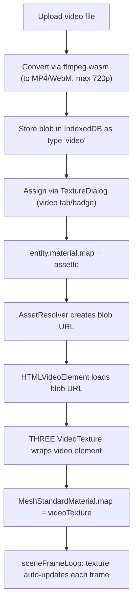

# Video Texture Feature (plan)

**Status:** Implemented — see [feature-video-texture.md](feature-video-texture.md).  
**Overview:** Add video texture support to Renn: upload video files, convert to web-compatible format via ffmpeg.wasm, extend the texture/asset system to handle video, and render videos on entity surfaces using Three.js VideoTexture.

## Milestone checklist

- [x] **Milestone 1:** Video upload and conversion pipeline (`videoManager`, `videoConverter`, ffmpeg.wasm). Visual check: convert a file, play result in `<video>`.
- [x] **Milestone 2:** Video asset type in data model and persistence (`world.ts`, `assetUpload`, `AssetPanel`, export/import). Visual check: upload video in Asset Panel, export/import ZIP.
- [x] **Milestone 3:** Video-aware TextureDialog and conversion progress UI (`TextureDialog`, `VideoConversionDialog`, `VideoThumbnail`, `MaterialEditor`). Visual check: videos in dialog with badges, conversion progress modal.
- [x] **Milestone 4:** Three.js VideoTexture rendering (`assetResolverImpl`, `createPrimitive`, `renderItemRegistry`, `SceneView`). Visual check: video plays on entity in Builder and Play.
- [x] **Milestone 5:** Cleanup, testing, documentation (integration tests, disposal, prefetch skip, agent-context). Visual check: multi-entity scene, no leaks, `npm test` passes.

**Dev regression (fixed):** Vite + `@ffmpeg/ffmpeg` without `classWorkerURL` broke the internal worker (404 under `.vite/deps/worker.js`), leaving conversion at 0%. **Firefox** also logged `NS_ERROR_DOM_MEDIA_METADATA_ERR` for poster thumbnails when the picked file was not a real MP4 (e.g. tiny/HTML stub). Details: [feature-video-texture.md § Troubleshooting](feature-video-texture.md#troubleshooting-vite-dev--firefox-2026-04).

---

## Context

Currently Renn supports static image textures (PNG, JPG, GIF, WEBP) on entity materials. The pipeline is: upload image → store blob in IndexedDB → reference via `material.map` asset id → `TextureLoader` loads blob URL into `THREE.Texture` → applied to `MeshStandardMaterial`. There is no video handling anywhere in the codebase.

## Architecture overview

## Milestones

### Milestone 1: Video upload and conversion pipeline

**Goal:** User can upload a video file and it gets converted to a web-friendly format. A standalone test page or console output confirms the conversion works.

**Files to create/modify:**

- New: `src/utils/videoManager.ts` — validation, MIME detection, format constants (parallel to `TextureManager`)
- New: `src/utils/videoConverter.ts` — ffmpeg.wasm wrapper: load WASM, transcode to MP4 (H.264) at max 720p, return a Blob
- Modified: `package.json` — add `@ffmpeg/ffmpeg` and `@ffmpeg/util` dependencies

**Key decisions:**

- Target format: **MP4 (H.264 + AAC)** — widest browser support; fallback to WebM (VP9) not needed initially
- Max resolution: **720p** (1280×720) to keep file sizes manageable for IndexedDB
- Max file size on upload: **100 MB** (pre-conversion); post-conversion blobs may be smaller
- ffmpeg.wasm runs in a **Web Worker** via its built-in threading; show progress callback

**Visual check:** Upload a .mov or .avi file, see console log confirming conversion completed with output size and duration. Play the resulting blob in a temporary `<video>` element to verify it works.

---

### Milestone 2: Video asset type in the data model and persistence

**Goal:** Videos are stored, loaded, and exported just like other assets. The asset panel shows them with a distinguishing badge.

**Files to modify:**

- `src/types/world.ts` — add `'video'` to `AssetRef.type` union
- `src/utils/assetUpload.ts` — new `uploadVideo()` function (validate, convert, persist)
- `src/utils/textureManager.ts` — add video MIME/extension awareness (`isVideoFile`, `getVideoAssets`)
- `src/components/AssetPanel.tsx` — recognize video assets in the upload flow (detect `video/*` MIME)
- `src/loader/loadWorldFromStatic.ts` — fetch video blobs by type when loading static worlds
- `src/utils/assetExport.ts` — handle video extension inference for ZIP export

**Visual check:** Upload a video via the Asset Panel. See it listed with a video icon/badge. Export a project ZIP and confirm the video file is inside `assets/`. Re-import the ZIP and confirm the video asset is restored.

---

### Milestone 3: Video-aware TextureDialog and conversion progress UI

**Goal:** The TextureDialog shows both images and videos, clearly distinguished. A conversion progress dialog appears when uploading a video.

**Files to modify:**

- `src/components/TextureDialog.tsx` — accept `video/*` in file input and drag-drop; show video thumbnail (poster frame or play icon overlay); badge items as "image" or "video"
- New: `src/components/VideoConversionDialog.tsx` — modal showing conversion progress (percentage bar), cancel button, error display; wraps `videoConverter.ts`
- `src/components/MaterialEditor.tsx` — wire up video upload through the same `onUploadTexture` flow; show a video indicator when `material.map` points to a video asset
- New: `src/components/VideoThumbnail.tsx` — render a poster frame from a video blob (grab first frame via canvas)

**Visual check:** Open TextureDialog from the Material section of the property inspector. See both image and video assets listed, clearly labeled. Upload a new video — see the conversion progress dialog. After conversion, the video appears in the dialog grid with a poster-frame thumbnail and a play icon badge.

---

### Milestone 4: Three.js VideoTexture rendering

**Goal:** A video assigned as `material.map` plays on the entity surface in both Builder and Play views.

**Files to modify:**

- `src/loader/assetResolverImpl.ts` — new `loadVideoTexture(assetId)`: create `HTMLVideoElement` from blob URL, return `THREE.VideoTexture`; manage video element lifecycle (play, loop, mute for autoplay policy)
- `src/loader/createPrimitive.ts` — in `materialFromRef`, detect video asset (by checking asset type or MIME), use `loadVideoTexture` instead of `TextureLoader`; `VideoTexture` auto-updates so no per-frame work needed beyond what Three.js does internally
- `src/runtime/renderItemRegistry.ts` — `updateMaterial` must handle video textures on material swap (dispose old video element + texture)
- `src/components/SceneView.tsx` — on cleanup, dispose all video elements (pause + remove src)
- `src/runtime/sceneFrameLoop.ts` — no changes expected; `VideoTexture` sets `needsUpdate` automatically each frame

**Key implementation details:**

- `THREE.VideoTexture` wraps an `HTMLVideoElement`. The video element must be `muted` for autoplay to work (browser policy). Set `video.loop = true`, `video.muted = true`, `video.playsInline = true`, then `video.play()`.
- The asset resolver needs to know whether an asset is a video. Pass the world's asset registry or a type-lookup function so it can check `world.assets[id].type === 'video'`.
- UV repeat/wrap/offset/rotation from `MaterialRef` apply to `VideoTexture` the same as image textures.

**Visual check:** Create a box entity, assign a video texture via the property inspector. See the video playing on all faces of the box in the Builder viewport. Enter Play mode and confirm it still plays. Resize the viewport — video keeps playing. Select a different entity and come back — video resumes.

---

### Milestone 5: Cleanup, testing, and documentation

**Goal:** Integration tests pass, edge cases handled, agent-context documentation updated.

**Work items:**

- Add integration tests for the video pipeline (upload → convert → store → render)
- Handle edge cases: video decode errors, unsupported codecs, very large files, conversion failures
- Video disposal on entity delete or material change (pause video, revoke blob URL, dispose texture)
- `src/loader/prefetchMaterialTextures.ts` — skip video assets (no `createImageBitmap` for video)
- `src/utils/textureDownscale.ts` — skip or handle video assets in Performance Booster
- Update `agent-context/README.md` and `agent-context/start-here.md` with video texture references
- After implementation: expand this file or add `feature-video-texture.md` with implementation notes (Milestone 5 deliverable)

**Visual check:** Open a project with multiple entities (some with image textures, some with video textures). All render correctly. Delete a video-textured entity — no console errors or memory leaks. Switch between Builder and Play — videos restart properly. Run `npm test` — all tests pass.

## Files summary

**New files:**

- `src/utils/videoManager.ts` — validation, MIME detection, format helpers
- `src/utils/videoConverter.ts` — ffmpeg.wasm transcoding wrapper
- `src/components/VideoConversionDialog.tsx` — progress UI for conversion
- `src/components/VideoThumbnail.tsx` — poster frame extraction
- `agent-context/feature-video-texture.md` — feature documentation (post-implementation; see Milestone 5)

**Modified files:**

- `package.json` — `@ffmpeg/ffmpeg`, `@ffmpeg/util`
- `src/types/world.ts` — `AssetRef.type` adds `'video'`
- `src/utils/assetUpload.ts` — `uploadVideo()`
- `src/utils/textureManager.ts` — video awareness
- `src/components/TextureDialog.tsx` — show video assets, accept video files
- `src/components/MaterialEditor.tsx` — video indicator
- `src/components/AssetPanel.tsx` — video upload recognition
- `src/loader/assetResolverImpl.ts` — `loadVideoTexture`
- `src/loader/createPrimitive.ts` — video branch in `materialFromRef`
- `src/runtime/renderItemRegistry.ts` — video texture disposal
- `src/components/SceneView.tsx` — video cleanup
- `src/loader/loadWorldFromStatic.ts` — video asset fetching
- `src/utils/assetExport.ts` — video extension handling
- `src/loader/prefetchMaterialTextures.ts` — skip videos
- `agent-context/README.md`, `agent-context/start-here.md` — references (Milestone 5)
