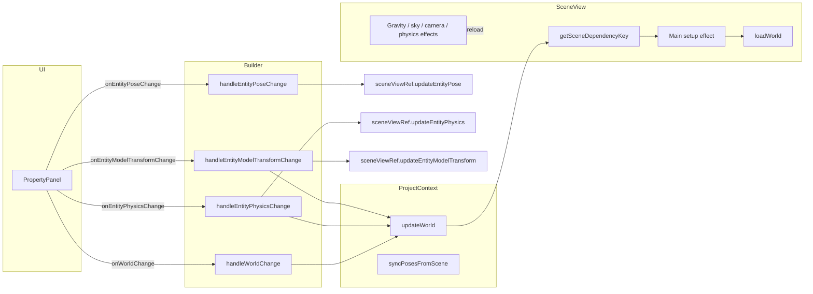

# World update path and minimal rebuild strategy

How property edits flow from the UI to world state and when the 3D scene is rebuilt. Use this when working on inspector updates, scene reload behavior, or adding incremental (single-property) updates.

## End-to-end update flow



1. **PropertyPanel** ([src/components/PropertyPanel.tsx](src/components/PropertyPanel.tsx))  
   Most edits call `updateEntity(patch)` which builds a new `world` and invokes `onWorldChange(newWorld)`. Transform position/rotation can instead call `onEntityPoseChange(id, pose)`. Physics properties (mass, restitution, friction, damping, bodyType) call `onEntityPhysicsChange(id, patch)` when provided. Model rotation/scale (for trimesh or entity.model) call `onEntityModelTransformChange(id, patch)` when provided.

2. **Builder** ([src/pages/Builder.tsx](src/pages/Builder.tsx))  
   - `captureScenePosesForNextRebuild()`: copies `sceneViewRef.current?.getAllPoses()` into `initialPosesRef` so the next full scene rebuild reapplies live poses for existing entity ids (avoids snapping everything back to document transforms after physics/simulation).  
   - `handleWorldChange(newWorld)`: calls `captureScenePosesForNextRebuild()` only when `worldChangesRequireSceneRebuild(prev, newWorld)` (incremental workspace edits such as pipe-stack bootstrap must not snapshot live poses), then `updateWorld(() => newWorld)`. `initialPosesRef` is cleared synchronously when `documentEpoch` changes (project load / new project) so stale poses are never restored across projects.  
   - `handleAddEntity`, `handleBulkAddEntities`, `handleDeleteEntity`, `handleCloneEntity`: each calls `captureScenePosesForNextRebuild()` before `updateWorld`, because these paths change the entity list (rebuild key) without going through `handleWorldChange`.  
   - `handleEntityTransformersChange`: calls `syncEntityTransformers` directly; all transformer changes are now incremental and do not trigger a full scene rebuild.
   - `handleEntityShapeChange` (trimesh / fallback rebuild branch): calls `captureScenePosesForNextRebuild()` before `updateWorld`.  
   - `handleEntityPoseChange(id, pose)`: calls `sceneViewRef.current?.updateEntityPose(id, pose)` only (no world state update until an explicit sync, e.g. Refresh from physics or save).  
   - `handleEntityPhysicsChange(id, patch)`: calls `sceneViewRef.current?.updateEntityPhysics(id, patch)` to update the body/collider directly, then calls `updateWorld(...)` directly (bypassing `handleWorldChange`, so no `initialPosesRef` capture) to keep the document in sync.  
   - `handleEntityModelTransformChange(id, patch)`: calls `sceneViewRef.current?.updateEntityModelTransform(id, patch)` to update the mesh's model scene rotation/scale, optional `doubleSided` GLTF shading (via `applyModelVisualSides`), and rebuild trimesh collider only when rotation or scale changed, then calls `updateWorld(...)` to keep the document in sync; no full reload.

3. **ProjectContext** ([src/contexts/ProjectContext.tsx](src/contexts/ProjectContext.tsx))  
   - `updateWorld(updater)`: applies updater to previous world, updates `worldRef.current`, calls `setWorld(next)`, marks project dirty.  
   - `syncPosesFromScene(poses)`: merges poses into entities and calls `setWorld(merged)` so the document matches the scene.

4. **SceneView** ([src/components/SceneView.tsx](src/components/SceneView.tsx))  
   - Main setup effect depends on `sceneKey = getSceneDependencyKey(world)` (and version, runPhysics, etc.). When `sceneKey` changes, the effect runs: teardown, `loadWorld(world, assets)`, create physics and registry, then apply `initialPosesRef` and call `onPosesRestored` so Builder can sync poses back.  
   - **Builder camera restore**: teardown saves the viewport to `savedCameraStateRef` when **camera control is free** *or* **edit-navigation is on** (reads `editNavigationModeRef` in cleanup). On load, the camera is restored from that ref if the user is in free placement (free control or edit nav); otherwise from `world.camera.editorFreePose` if present; otherwise `defaultPosition`/`defaultRotation`; else defaults. Throttled updates write the live pose to `ProjectContext.editorFreePoseRef` for merge on save (`getWorldToSave`).  
   - Separate effects update gravity, sky color, camera config, and shadows **without** running the main effect.  
   - Imperative API: `updateEntityPose(id, pose)` updates the registry (mesh + physics body) directly; no world change and no rebuild.  
   - Imperative API: `updateEntityPhysics(id, patch)` forwards to `RenderItemRegistry.updatePhysics` → `PhysicsWorld` setters, mutating the body/collider directly; no rebuild.  
   - Imperative API: `updateEntityModelTransform(id, patch)` forwards to `RenderItemRegistry.setModelTransform` → updates the mesh's model-scene child rotation/scale when those fields are in `patch`, merges `doubleSided` (persisted as truthy only), applies `applyModelVisualSides` from `createPrimitive.ts`, and for trimesh calls `PhysicsWorld.updateShape` only when rotation or scale changed; no full reload.

So: **world changes** go through `onWorldChange` → `updateWorld` → new `world` prop to SceneView. **Whether the scene rebuilds** is decided by the **rebuild key**, not by the fact that `world` changed.

## Why position is live, physics props are live, but shape/size triggers rebuild

- **Position/rotation**  
  The UI uses `onEntityPoseChange`, which calls `SceneView.updateEntityPose(id, pose)`. That updates `RenderItemRegistry` (mesh position/rotation and physics body transform) only. The world document is not updated on every drag; it can be synced later via Refresh from physics or save. The rebuild key in [src/utils/sceneDependencyKey.ts](src/utils/sceneDependencyKey.ts) **excludes** `entity.position` and `entity.rotation`, so even if we did call `onWorldChange` with updated pose, the scene would not rebuild.

- **Physics properties (mass, restitution, friction, linearDamping, angularDamping, bodyType)**  
  The UI uses `onEntityPhysicsChange(id, patch)`, which calls `SceneView.updateEntityPhysics(id, patch)` → `RenderItemRegistry.updatePhysics` → `PhysicsWorld` setters that mutate the existing Rapier body/collider in-place. The world document is updated via `updateWorld` directly. The rebuild key **excludes** all these properties, so no rebuild occurs.

- **Primitive shape changes (box, sphere, cylinder, capsule, cone, pyramid, plane)**  
  The UI uses `onEntityShapeChange(id, patch)`. Builder calls `sceneViewRef.updateEntityShape(id, entity)` → `RenderItemRegistry.updateShape` → swaps `mesh.geometry` (dispose old, create new via `createShapeGeometry`), handles the plane `visualBaseQuaternion` transition when switching to/from plane vs solids, updates `castShadow` from world AABB (`updateMeshCastShadowFromWorldAabb`), then calls `PhysicsWorld.updateShape` to rebuild the collider (remove old, create new with all physics props re-applied). The rebuild key includes `trimeshShape` only when the shape type is trimesh, so primitive shape changes don't trigger a rebuild.

- **Material changes**  
  The UI uses `onEntityMaterialChange(id, patch)`. Builder calls `sceneViewRef.updateEntityMaterial(id, entity)` → `RenderItemRegistry.updateMaterial` → `materialFromRef(newMaterial, assetResolver)` (async, may load texture) → replaces `mesh.material` (and all child materials for model meshes), disposing the old one; then `applyModelVisualSides` reconciles `THREE` material `side` from `entity.doubleSided` and stored GLTF clones. Material includes `opacity` (0–1, default 1); when opacity is below 1, `materialFromRef` sets `transparent` and adjusts depth write for correct blending. The call is fire-and-forget; world state is updated synchronously. The rebuild key **excludes** `material`, so no rebuild occurs.

- **Texture brush (Builder paint mode)**  
  The **Brush tool** sits **left of** Move / Rotate / Scale on the header row. Clicking it selects paint mode (when the selection has a texture) and opens a **floating popover** (`createPortal` to `document.body`, `data-testid="brush-tool-popover"`, `#builder-brush-toolbar-panel`) anchored under the brush button—no extra header row; it does not shrink the canvas. Color uses **[react-colorful](https://github.com/omgovich/react-colorful)** `HexColorPicker` + `HexColorInput` (`data-testid="texture-brush-color"`); size uses `input type="range"` 1–800 px (`data-testid="texture-brush-size"`). The popover can include **Open texture maker** (`data-testid="brush-open-texture-maker"`) when a single entity is selected (including **no** `material.map` yet). The **Brush** control is enabled in that case. **First 3D brush stroke with no map:** `prepareWorldPaintStroke` in Builder (`SceneView` → `installBuilderPickAndGizmo`) creates the same 500×500 `custom_texture` composite as Texture maker, applies it to `material.map`, then the stroke paints the layer (`handleTexturePaintStrokeEnd` recomposites). From the **Material** panel, **Texture maker…** (`data-testid="material-open-texture-maker"`) is available with **no** map: it creates the document, assigns the composite, and opens the studio. Styling: [`BrushToolPopover.css`](../src/components/BrushToolPopover.css) overrides `.react-colorful` / hex field. Outside click and Escape close the popover; **clicks on the 3D canvas do not** (`BUILDER_SCENE_CANVAS_HOST_ATTR` on the SceneView WebGL host). Leaving paint mode (another gizmo) closes it. State: `textureBrushRgb`, `textureBrushRadiusPx` → SceneView `getBrushRgba` / `getBrushRadiusPx`. [`installBuilderPickAndGizmo`](../src/editor/transformGizmoController.ts) detaches `TransformControls`, keeps selection on empty clicks (unlike normal pick mode), and on drag on the **selected** entity stamps albedo using [`paintTextureBlob`](../src/utils/texturePaint.ts). The painted blob id is `getPaintTargetAssetId(entityId)` when that returns a layer id, otherwise `entity.material.map`. **Copy-on-first-paint:** [`resolvePaintStrokeWriteTarget`](../src/utils/paintAssetRouting.ts) forks imported-style ids to `tex_paint_*` and updates `material.map` once; layer ids (`texlayer_*`) update in place and trigger compositor reflatten when a [`TextureDocument`](../src/utils/textureCompositor.ts) is active. On pointer-up, [`handleTexturePaintStrokeEnd`](../src/pages/Builder.tsx) calls `updateAssets` (and recomposites when painting layers), then `sceneViewRef.updateEntityMaterial` on the next animation frame. [`updateAssets`](../src/contexts/ProjectContext.tsx) persists to IndexedDB when an asset id’s `Blob` reference changes. **Layered textures:** [`TextureMaker`](../src/components/TextureMaker/TextureMaker.tsx) and **Texture maker…** in [`MaterialEditor`](../src/components/MaterialEditor.tsx) (`data-testid="material-open-texture-maker"`). See [feature-texture-compositor.md](./feature-texture-compositor.md). Undo: `EditorUndoContext.pushBeforeEdit` at stroke start (via `pushUndoBeforePaintStroke`).

- **Model rotation/scale / double-sided GLTF (`modelRotation`, `modelScale`, `doubleSided`)**  
  The UI uses `onEntityModelTransformChange(id, patch)` when provided. Builder calls `sceneViewRef.updateEntityModelTransform(id, patch)` → `RenderItemRegistry.setModelTransform` → applies rotation/scale to the mesh's model-scene child when patched, merges `doubleSided`, reconciles sides with `applyModelVisualSides`, and for trimesh calls `PhysicsWorld.updateShape` only when rotation or scale changed. The rebuild key **excludes** these fields (they are applied incrementally), so no full reload.

- **Trimesh shape changes and other structural properties (model)**  
  These are edited via `onWorldChange(newWorld)`. The rebuild key **includes** `trimeshShape` (for trimesh shapes), `model`, `scripts`, and world lights/assets/scripts. **Scale** is excluded and applied incrementally via `updateEntityPose` / `setScale`. So trimesh/model/script changes still trigger a full scene rebuild when the key changes; scale alone does not.

## Rebuild key: what is included and excluded

Defined in [src/utils/sceneDependencyKey.ts](src/utils/sceneDependencyKey.ts). The key is a string derived from a subset of the world; when it changes, SceneView's main effect runs (full reload).

**Included (change triggers rebuild):**

- **World**: `version`, `assets`, `scripts`, `world.ambientLight`, `world.directionalLight`.
- **Per entity**: `id`, `trimeshShape` (shape only when `shape.type === 'trimesh'`), `model`, `scripts`. (`scale`, `modelRotation`, `modelScale`, `doubleSided` GLTF shading, and all transformer changes are excluded; scale via `updateEntityPose`, model transform and sides via `updateEntityModelTransform`, transformers via `syncEntityTransformers`.)

**Excluded (change does not trigger rebuild):**

- **Per entity**: `name`, `locked`, `position`, `rotation`, `scale`, `modelRotation`, `modelScale`, `doubleSided`, `bodyType`, `mass`, `restitution`, `friction`, `linearDamping`, `angularDamping`, primitive shape dimensions, `material`, `transformers` (structure, order, code, params, enabled).
- **World**: `world.gravity`, `world.skyColor`, `world.skybox`, `world.camera` (these are applied by dedicated effects in SceneView).

Entity add/remove changes the entity list, so the key changes and a rebuild runs.

## Property behavior matrix

Use this to answer "does changing this property rebuild the scene?"

| Property / area | Behavior | Notes |
|-----------------|----------|--------|
| **entity.position** | Incremental | `onEntityPoseChange` → registry + body; not in rebuild key. |
| **entity.rotation** | Incremental | Same as position. |
| **entity.name** | Metadata only | Not in rebuild key; no scene change. |
| **entity.locked** | Metadata only | Not in rebuild key; drag check may use stale mesh userData until next rebuild. |
| **entity.shape** (primitive) | Incremental | `onEntityShapeChange` → `RenderItemRegistry.updateShape` → geometry swap + `PhysicsWorld.updateShape`; not in rebuild key. |
| **entity.shape** (trimesh) | Rebuild | `trimeshShape` in key; requires full mesh reload from asset. |
| **entity.scale** | Incremental | `onEntityPoseChange` / `updateEntityPose` → `RenderItemRegistry.setScale`; not in rebuild key. |
| **entity.material** | Incremental | `onEntityMaterialChange` → `RenderItemRegistry.updateMaterial` → `materialFromRef` (async, texture-aware); not in rebuild key. |
| **entity.model** | Rebuild | In key (trimesh). |
| **entity.modelRotation** | Incremental | `onEntityModelTransformChange` → `RenderItemRegistry.setModelTransform` → model-scene + trimesh collider rebuild; not in rebuild key. |
| **entity.modelScale** | Incremental | Same as modelRotation. |
| **entity.bodyType** | Incremental | `onEntityPhysicsChange` → `PhysicsWorld.setBodyType`; not in rebuild key. |
| **entity.mass** | Incremental | `onEntityPhysicsChange` → `PhysicsWorld.setMass` (density); not in rebuild key. |
| **entity.restitution** | Incremental | `onEntityPhysicsChange` → `PhysicsWorld.setRestitution`; not in rebuild key. |
| **entity.friction** | Incremental | `onEntityPhysicsChange` → `PhysicsWorld.setFriction`; not in rebuild key. |
| **entity.linearDamping** | Incremental | `onEntityPhysicsChange` → `PhysicsWorld.setLinearDamping`; not in rebuild key. |
| **entity.angularDamping** | Incremental | `onEntityPhysicsChange` → `PhysicsWorld.setAngularDamping`; not in rebuild key. |
| **entity.scripts** | Rebuild | In key. |
| **entity.transformers** | Incremental | `onEntityTransformersChange` → `syncEntityTransformers`; all structural/config changes handled live; not in rebuild key. |
| **world.gravity** | Incremental | Dedicated effect: `pw.setGravity(gravity)`. |
| **world.skyColor** | Incremental | Dedicated effect: `scene.background`. |
| **world.skybox** | Incremental | Dedicated effect: sky dome mesh + texture from project assets (`world.world.skybox` = texture asset id). |
| **world.camera** (config) | Incremental | Dedicated effect: `cameraCtrl.setConfig`. |
| **Shadows enabled** | Incremental | Effect toggles renderer and directional light. |
| **world.ambientLight, world.directionalLight** | Rebuild | In key. |
| **world.scripts, world.assets** | Rebuild | In key. |
| **Entity add/remove** | Rebuild | Entity list and ids in key. |

## Known gaps

- **entity.locked**: Excluded from rebuild key, but editor drag logic may read lock state from mesh `userData`. Toggling lock without a rebuild can leave drag behavior out of sync until the next reload.
- **world.wind**: Read in the frame loop for transformers; not part of the rebuild key and no dedicated effect. Wind changes may not apply until something else triggers a reload.

## Minimal-rebuild roadmap (implementation guidance)

To make world rebuilds minimal when editing a single entity's remaining structural properties (scale, model):

1. **Scale hot update** (implemented)  
   `entity.scale` is excluded from the scene dependency key. Scale changes go through `SceneView.updateEntityPose` → `RenderItemRegistry.setScale` → `patchScale` + `commitScalePhysics` (collider rebuild). The gizmo scale tool can bake into shape dimensions / `modelScale` on commit so authored size lives in the shape instead of `entity.scale`.

2. **Model hot update**  
   Model changes require async GLTF loading (similar to material). Load the new model via `assetResolverRef`, remove the old mesh from the scene, create a new one, add it, and update the registry entry.

3. **Keep sync paths**  
   Continue using `syncPosesFromScene` / `onPosesRestored` and existing pose capture on world change so that when a full rebuild does run, poses are restored and the world document is updated accordingly.

## Key files

```
src/
├── components/PropertyPanel.tsx   # updateEntity → onWorldChange; pose → onEntityPoseChange; physics → onEntityPhysicsChange
├── pages/Builder.tsx             # handleWorldChange, handleEntityPoseChange, handleEntityPhysicsChange, initialPosesRef
├── contexts/ProjectContext.tsx   # updateWorld, syncPosesFromScene, syncPosesToRefOnly
├── components/SceneView.tsx      # sceneKey in effect deps; updateEntityPose/Physics/Shape/Material; gravity/sky/camera effects
├── utils/sceneDependencyKey.ts   # getSceneDependencyKey: included vs excluded fields
├── physics/rapierPhysics.ts      # PhysicsWorld: setLinearDamping/AngularDamping/Restitution/Friction/Mass/BodyType + updateShape
├── runtime/renderItemRegistry.ts # setPosition, setRotation, setModelTransform, updatePhysics, updateShape, updateMaterial
└── loader/createPrimitive.ts     # createShapeGeometry + materialFromRef: hot-swap helpers
```

See **feature-inspector.md** for inspector data flow and the no-update-loop rule.
