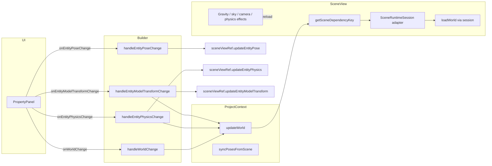

# World update path and minimal rebuild strategy

How property edits flow from the UI to world state and when the 3D scene is rebuilt. Use this when working on inspector updates, scene reload behavior, or adding incremental (single-property) updates.

## End-to-end update flow


```mermaid
flowchart LR
  subgraph ui [UI]
    PropertyPanel[PropertyPanel]
  end
  subgraph builder [Builder]
    handleWorldChange[handleWorldChange]
    handlePoseChange[handleEntityPoseChange]
    handlePhysicsChange[handleEntityPhysicsChange]
    handleModelTransformChange[handleEntityModelTransformChange]
  end
  subgraph context [ProjectContext]
    updateWorld[updateWorld]
    syncPoses[syncPosesFromScene]
  end
  subgraph scene [SceneView]
    sceneKey[getSceneDependencyKey]
    mainEffect[SceneRuntimeSession adapter]
    loadWorld[loadWorld via session]
    incrementalEffects[Gravity / sky / camera / physics effects]
  end
  PropertyPanel -->|onWorldChange| handleWorldChange
  PropertyPanel -->|onEntityPoseChange| handlePoseChange
  PropertyPanel -->|onEntityPhysicsChange| handlePhysicsChange
  PropertyPanel -->|onEntityModelTransformChange| handleModelTransformChange
  handleWorldChange --> updateWorld
  handlePoseChange --> SceneViewRef[sceneViewRef.updateEntityPose]
  handlePhysicsChange --> SceneViewRef2[sceneViewRef.updateEntityPhysics]
  handlePhysicsChange --> updateWorld
  handleModelTransformChange --> SceneViewRef3[sceneViewRef.updateEntityModelTransform]
  handleModelTransformChange --> updateWorld
  updateWorld --> sceneKey
  sceneKey --> mainEffect
  mainEffect --> loadWorld
  incrementalEffects -.->|no full reload| scene
```

1. **PropertyPanel** ([src/components/PropertyPanel.tsx](src/components/PropertyPanel.tsx))  
   Most edits call `updateEntity(patch)` which builds a new `world` and invokes `onWorldChange(newWorld)`. Transform position/rotation can instead call `onEntityPoseChange(id, pose)`. Physics properties (mass, restitution, friction, damping, bodyType) call `onEntityPhysicsChange(id, patch)` when provided. Model rotation/scale (for trimesh or entity.model) call `onEntityModelTransformChange(id, patch)` when provided.

2. **Builder** ([src/pages/Builder.tsx](src/pages/Builder.tsx))  
   - `captureScenePosesForNextRebuild()`: copies `sceneViewRef.current?.getAllPoses()` into `initialPosesRef` so the next full scene rebuild reapplies live poses for existing entity ids (avoids snapping everything back to document transforms after physics/simulation). `initialPosesRef` is cleared synchronously when `documentEpoch` changes (project load / new project) so stale poses are never restored across projects.  
   - **World-edit seam** — [`applyWorldEdit`](../src/editor/applyWorldEdit.ts): single entry point for most document writes. Dependency-injected function (not a hook): deps `{ updateWorld, bumpVersion, pushBeforeEdit, captureScenePosesForNextRebuild, syncWorldEntities }`; descriptor `{ undo: 'push' | 'skip'; scene: 'auto' | 'rebuild' | 'sync' | 'none' }`. `scene: auto` → `worldChangesRequireSceneRebuild`; `rebuild` → capture then bump; `sync` → `syncWorldEntities` only; `none` → caller already ran imperative scene op. Builder builds deps once in `worldEditDeps` (`useMemo`); **17 handlers** call through it.  
   - **Ordering invariants** (`applyWorldEdit.test.ts`; do not reorder): (1) `pushBeforeEdit` before `updateWorld`; (2) `captureScenePosesForNextRebuild()` before `bumpVersion()`.  
   - **Write-then-scene inside `applyWorldEdit`** — uniform and not observable: `syncWorldEntities(prev, next)` reads only its two args and SceneView refs (never Builder `world`/`worldRef`), is async and un-awaited, so work lands after React commit regardless of call order; `captureScenePosesForNextRebuild` reads live poses via `getAllPoses()` independent of the document; `bumpVersion` and `updateWorld` batch as React setters. Pre-refactor Builder was inconsistent (add/delete/clone/paste: write→scene; shape change, mesh simplification, `handleWorldChange`: scene→write).  
   - `handleWorldChange(newWorld)`: `applyWorldEdit(..., { undo: 'skip', scene: 'auto' }, () => newWorld)`. Classifies against authoritative `prev` from the `updateWorld` updater (not lagging React `world`); two same-tick edits classify the second against the first result (`Builder.test.tsx`). Gateway — callers push undo themselves or skip for live previews.  
   - Routed handlers (examples): add/bulk-add/delete/clone/paste → `{ undo: 'push', scene: 'sync' }`; gizmo pose commit, group create/ungroup/add/remove/rename → `{ undo: 'push', scene: 'none' }`; physics/material/model-transform → scene op first, then `{ undo: 'skip', scene: 'none' }`.  
   - **Not routed** (do not "finish the job" blindly): `handleEntityShapeChange` — branches on `updateEntityShape` return value, not static classifier (scene→write); `handleEntityTransformersChange` — bespoke `syncMergedEntityTransformers`; `handleApplyTextureDownscale` — assets only; `handleApplyMeshSimplification` — async, two document writes, unconditional rebuild; `handleEntityPoseChange`, `handleResetPoseToSavedWorld`, `handleRefreshFromPhysics` — scene-only, no document write.  
   - **Intentional undo omissions**: `handleResetCamera` (strips transient `editorFreePose`); `handleToggleGroupCollapsed` (UI flag); `handleWorldChange` (gateway). Live number-scrub coalescing is owned by `EditorUndoApi.notifyScrubStart` / `notifyScrubEnd` at the number-field seam — not by stage-strip patch commits (see § Stage edits in `WorkspaceTransformersTab` below).  
   - `applyHistorySnapshot` (undo/redo): when `canApplyWorldSnapshotIncrementally(prev, snap)` is true, applies snapshot without bumping scene `version` and calls `syncWorldEntities`; otherwise full reload via `applyEditorSnapshot(..., { reloadScene: true })`.  
   - `handleEntityTransformersChange`: calls `syncEntityTransformers` directly; all transformer changes are now incremental and do not trigger a full scene rebuild.
   - `handleEntityShapeChange`: imperative `updateEntityShape` first; on failure captures poses and bumps version, then `updateWorld` (not via `applyWorldEdit`).  
   - `handleEntityPoseChange(id, pose)`: calls `sceneViewRef.current?.updateEntityPose(id, pose)` only (no world state update until an explicit sync, e.g. Refresh from physics or save).  
   - `handleEntityPhysicsChange(id, patch)`: scene op first, then `applyWorldEdit(..., { undo: 'skip', scene: 'none' }, ...)`.  
   - `handleEntityModelTransformChange(id, patch)`: scene op first (`updateEntityModelTransform` — model-scene rotation/scale, `doubleSided`/`applyModelVisualSides`, trimesh collider when rotation/scale changed), then `applyWorldEdit(..., { undo: 'skip', scene: 'none' }, ...)`.

3. **ProjectContext** ([src/contexts/ProjectContext.tsx](src/contexts/ProjectContext.tsx))  
   - `updateWorld(updater)`: applies updater to previous world, updates `worldRef.current`, calls `setWorld(next)`, marks project dirty.  
   - `syncPosesFromScene(poses)`: merges poses into entities and calls `setWorld(merged)` so the document matches the scene.
   - **`reloadWorld()`** (Builder **Project → Reload**): restores the world document from the **open baseline** (captured on new/load/example/import), bumps `version` + `documentEpoch`, and rebuilds physics from entity `position`/`rotation` in that document. Saved projects reload from IndexedDB via `loadProject`; example/unsaved sessions use the in-memory baseline (not live registry poses).

4. **SceneView** ([src/components/SceneView.tsx](src/components/SceneView.tsx))  
   - **Full restart** is owned by [`SceneRuntimeSession`](../src/runtime/sceneRuntimeSession.ts): a thin main `useEffect` builds `restartKey` via `buildSceneRuntimeRestartKey` (same inputs as before: `sceneKey = getSceneDependencyKey(world)`, Builder `version`, render-quality flags, `playMode`, etc.), then `createSceneRuntimeSession(...).start()` / cleanup `dispose()`. The session runs teardown, `loadWorld(world, assets)`, physics/registry async, frame loop, resize, builder pick/gizmo, and applies `initialPosesRef` + `onPosesRestored` on success — see [scene-runtime-session-extract.md](./scene-runtime-session-extract.md).  
   - **Builder camera restore**: teardown saves the viewport to `savedCameraStateRef` when **camera control is free** *or* **edit-navigation is on** (reads `editNavigationModeRef` in cleanup). On load, the camera is restored from that ref if the user is in free placement (free control or edit nav); otherwise from `world.camera.editorFreePose` if present; otherwise `defaultPosition`/`defaultRotation`; else defaults. Throttled updates write the live pose to `ProjectContext.editorFreePoseRef` for merge on save (`getWorldToSave`).  
   - Separate effects update gravity, sky color, camera config, and shadows **without** running the main effect. **`shadowsEnabled` is not in `buildSceneRuntimeRestartKey`** (main `useEffect` deps exclude it) so toggling World → Shadows does not reload the scene or reset live poses.  
   - **Game HUD** (`showGameHud`): overlay visibility only — toggling it does **not** run the main setup effect or reset entity poses; the frame loop reads `showGameHudRef` each tick.
   - Imperative API: `updateEntityPose(id, pose)` updates the registry (mesh + physics body) directly; no world change and no rebuild.  
   - Imperative API: `updateEntityPhysics(id, patch)` forwards to `RenderItemRegistry.updatePhysics` → `PhysicsWorld` setters, mutating the body/collider directly; no rebuild.  
   - Imperative API: `updateEntityModelTransform(id, patch)` forwards to `RenderItemRegistry.setModelTransform` → updates the mesh's model-scene child rotation/scale when those fields are in `patch`, merges `doubleSided` (persisted as truthy only), applies `applyModelVisualSides` from `createPrimitive.ts`, and for trimesh calls `PhysicsWorld.updateShape` only when rotation or scale changed; no full reload.
   - Imperative API: `syncWorldEntities(prev, next)` diffs entity lists and applies incremental add/remove/update (mesh, physics, scripts, transformers) without a full reload.

So: **world changes** go through `onWorldChange` → `applyWorldEdit` → `updateWorld` → new `world` prop to SceneView. **Rebuild vs sync** is not one function — see rebuild-key section.

## Why position is live, physics props are live, but shape/size triggers rebuild

- **Position/rotation**  
  The UI uses `onEntityPoseChange`, which calls `SceneView.updateEntityPose(id, pose)`. That updates `RenderItemRegistry` (mesh position/rotation and physics body transform) only. The world document is not updated on every drag; it can be synced later via Refresh from physics or save. The rebuild key in [src/utils/sceneDependencyKey.ts](src/utils/sceneDependencyKey.ts) **excludes** `entity.position` and `entity.rotation`, so even if we did call `onWorldChange` with updated pose, the scene would not rebuild.

- **Physics properties (mass, restitution, friction, linearDamping, angularDamping, bodyType)**  
  The UI uses `onEntityPhysicsChange(id, patch)`, which calls `SceneView.updateEntityPhysics(id, patch)` → `RenderItemRegistry.updatePhysics` → `PhysicsWorld` setters that mutate the existing Rapier body/collider in-place. The world document is updated via `updateWorld` directly. The rebuild key **excludes** all these properties, so no rebuild occurs.

- **Primitive shape changes (box, sphere, cylinder, capsule, cone, pyramid, plane)**  
  The UI uses `onEntityShapeChange(id, patch)`. Builder calls `sceneViewRef.updateEntityShape(id, entity)` → `RenderItemRegistry.updateShape` → swaps `mesh.geometry` (dispose old, create new via `createShapeGeometry`), handles the plane `visualBaseQuaternion` transition when switching to/from plane vs solids, updates `castShadow` from world AABB (`updateMeshCastShadowFromWorldAabb`), then calls `PhysicsWorld.updateShape` to rebuild the collider (remove old, create new with all physics props re-applied). The rebuild key includes `trimeshShape` only when the shape type is trimesh, so primitive shape changes don't trigger a rebuild.

- **Material changes**  
  The UI uses `onEntityMaterialChange(id, patch)`. Builder calls `sceneViewRef.updateEntityMaterial(id, entity)` → `RenderItemRegistry.updateMaterial` → `materialFromRef(newMaterial, assetResolver)` (async, may load texture) → replaces `mesh.material` (and all child materials for model meshes), disposing the old one; then `applyModelVisualSides` reconciles `THREE` material `side` from `entity.doubleSided` and stored GLTF clones. Material includes `opacity` (0–1, default 1); when opacity is below 1, `materialFromRef` sets `transparent` and adjusts depth write for correct blending. The call is fire-and-forget; world state is updated synchronously. The rebuild key **excludes** `material`, so no rebuild occurs.

- **Texture brush (Builder paint mode)**  
  The **Brush tool** sits **left of** Move / Rotate / Scale on the header row. Clicking it selects paint mode (when the selection has a texture) and opens a **floating popover** (`createPortal` to `document.body`, `data-testid="brush-tool-popover"`, `#builder-brush-toolbar-panel`) anchored under the brush button—no extra header row; it does not shrink the canvas. Color uses **[react-colorful](https://github.com/omgovich/react-colorful)** `HexColorPicker` + `HexColorInput` (`data-testid="texture-brush-color"`); size uses `input type="range"` 1–800 px (`data-testid="texture-brush-size"`). The popover can include **Open texture maker** (`data-testid="brush-open-texture-maker"`) when a single entity is selected (including **no** `material.map` yet). The **Brush** control is enabled in that case. **First 3D brush stroke with no map:** `prepareWorldPaintStroke` in Builder (`SceneView` → `installBuilderPickAndGizmo`) creates the same 500×500 `custom_texture` composite as Texture maker, applies it to `material.map`, then the stroke paints the layer (`handleTexturePaintStrokeEnd` recomposites). From the **Material** panel, **Texture maker…** (`data-testid="material-open-texture-maker"`) is available with **no** map: it creates the document, assigns the composite, and opens the studio. Styling: [`BrushToolPopover.css`](../src/components/BrushToolPopover.css) overrides `.react-colorful` / hex field. Outside click and Escape close the popover; **clicks on the 3D canvas do not** (`BUILDER_SCENE_CANVAS_HOST_ATTR` on the SceneView WebGL host). Leaving paint mode (another gizmo) closes it. State: `textureBrushRgb`, `textureBrushRadiusPx` → SceneView `getBrushRgba` / `getBrushRadiusPx`. [`installBuilderPickAndGizmo`](../src/editor/transformGizmoController.ts) detaches `TransformControls`, keeps selection on empty clicks (unlike normal pick mode), and on drag on the **selected** entity stamps albedo using [`paintTextureBlob`](../src/utils/texturePaint.ts). The painted blob id is `getPaintTargetAssetId(entityId)` when that returns a layer id, otherwise `entity.material.map`. **Copy-on-first-paint:** [`resolvePaintStrokeWriteTarget`](../src/utils/paintAssetRouting.ts) forks imported-style ids to `tex_paint_*` and updates `material.map` once; layer ids (`texlayer_*`) update in place and trigger compositor reflatten when a [`TextureDocument`](../src/utils/textureCompositor.ts) is active. On pointer-up, [`handleTexturePaintStrokeEnd`](../src/pages/Builder.tsx) calls `updateAssets` (and recomposites when painting layers), then `sceneViewRef.updateEntityMaterial` on the next animation frame. [`updateAssets`](../src/contexts/ProjectContext.tsx) persists to IndexedDB when an asset id’s `Blob` reference changes. **Layered textures:** [`TextureMaker`](../src/components/TextureMaker/TextureMaker.tsx) and **Texture maker…** in [`MaterialEditor`](../src/components/MaterialEditor.tsx) (`data-testid="material-open-texture-maker"`). See [feature-texture-compositor.md](./feature-texture-compositor.md). Undo: `EditorUndoContext.pushBeforeEdit` at stroke start (via `pushUndoBeforePaintStroke`).

- **Model rotation/scale / double-sided GLTF (`modelPosition`, `modelRotation`, `modelScale`, `doubleSided`)**  
  The UI uses `onEntityModelTransformChange(id, patch)` when provided. Builder calls `sceneViewRef.updateEntityModelTransform(id, patch)` → `RenderItemRegistry.setModelTransform` → applies rotation/scale to the mesh's model-scene child when patched, merges `doubleSided`, reconciles sides with `applyModelVisualSides`, and for trimesh calls `PhysicsWorld.updateShape` only when rotation or scale changed. The rebuild key **excludes** these fields (they are applied incrementally), so no full reload.

- **Trimesh shape changes and other structural properties (model)**  
  These are edited via `onWorldChange(newWorld)`. The rebuild key **includes** `trimeshShape` (for trimesh shapes), `model`, `scripts`, and world lights/assets/scripts. **Scale** is excluded and applied incrementally via `updateEntityPose` / `setScale`. So trimesh/model/script changes still trigger a full scene rebuild when the key changes; scale alone does not.

## Rebuild key: what is included and excluded

Defined in [src/utils/sceneDependencyKey.ts](src/utils/sceneDependencyKey.ts). `getSceneDependencyKey` covers **world-level** fields only (used as SceneView main-effect dependency). **Rebuild-vs-sync has several implementations** — do not assume one classifier covers all paths:

| Implementation | Where | Role |
|----------------|-------|------|
| `worldChangesRequireSceneRebuild` | `sceneDependencyKey.ts` | Static classifier; `applyWorldEdit` `scene: 'auto'` and rebuild-key docs |
| `canApplyWorldSnapshotIncrementally` | `incrementalSceneSync.ts` | Negated wrapper; undo/redo snapshot apply |
| `updateEntityShape` return value | `handleEntityShapeChange` | Runtime feedback when hot-swap fails |
| Unconditional capture+bump | `handleApplyMeshSimplification` | Always rebuilds before async asset bake |

**World-level (change triggers rebuild via version bump):**

- **World**: `version`, `assets`, `scripts`, `world.ambientLight`, `world.directionalLight`.

**Per existing entity (structural change triggers rebuild via version bump):**

- `trimeshShape`, `model`, `modelSimplification` (for entity.model visuals), `scripts`.

**Entity add/remove (incremental — no rebuild):**

- Builder routes via `applyWorldEdit` `scene: 'sync'` → `SceneView.syncWorldEntities` → `buildLoadedEntity` + `RenderItemRegistry.addLoadedEntity` / `removeEntity` + `PhysicsWorld.addEntity` / `removeEntity`. Entity-list changes do not bump scene version.

**Excluded (change does not trigger rebuild):**

- **Per entity**: `name`, `locked`, `position`, `rotation`, `scale`, `modelPosition`, `modelRotation`, `modelScale`, `doubleSided`, `bodyType`, `mass`, `restitution`, `friction`, `linearDamping`, `angularDamping`, primitive shape dimensions, `material`, `transformers` (structure, order, code, params, enabled).
- **World**: `world.gravity`, `world.skyColor`, `world.skybox`, `world.fog`, `world.camera` (these are applied by dedicated effects in SceneView).

## Property behavior matrix

Use this to answer "does changing this property rebuild the scene?"

| Property / area | Behavior | Notes |
|-----------------|----------|--------|
| **entity.position** | Incremental | `onEntityPoseChange` → registry + body; not in rebuild key. |
| **entity.rotation** | Incremental | Same as position. |
| **entity.name** | Metadata only | Not in rebuild key; no scene change. |
| **entity.locked** | Metadata only | Not in rebuild key; drag check may use stale mesh userData until next rebuild. |
| **entity.shape** (primitive) | Incremental | `onEntityShapeChange` → `RenderItemRegistry.updateShape` → geometry swap + `PhysicsWorld.updateShape`; not in rebuild key. |
| **entity.shape** (trimesh) | Rebuild | `trimeshShape` in key; requires full mesh reload from asset. |
| **entity.scale** | Incremental | `onEntityPoseChange` / `updateEntityPose` → `RenderItemRegistry.setScale`; not in rebuild key. |
| **entity.material** | Incremental | `onEntityMaterialChange` → `RenderItemRegistry.updateMaterial` → `materialFromRef` (async, texture-aware); not in rebuild key. |
| **entity.model** | Rebuild | In key (trimesh). |
| **entity.modelPosition** | Incremental | `onEntityModelTransformChange` → `RenderItemRegistry.setModelTransform` → model-scene + trimesh collider rebuild; not in rebuild key. |
| **entity.modelRotation** | Incremental | Same as modelPosition. |
| **entity.modelScale** | Incremental | Same as modelPosition. |
| **entity.bodyType** | Incremental | `onEntityPhysicsChange` → `PhysicsWorld.setBodyType`; not in rebuild key. |
| **entity.mass** | Incremental | `onEntityPhysicsChange` → `PhysicsWorld.setMass` (density); not in rebuild key. |
| **entity.restitution** | Incremental | `onEntityPhysicsChange` → `PhysicsWorld.setRestitution`; not in rebuild key. |
| **entity.friction** | Incremental | `onEntityPhysicsChange` → `PhysicsWorld.setFriction`; not in rebuild key. |
| **entity.linearDamping** | Incremental | `onEntityPhysicsChange` → `PhysicsWorld.setLinearDamping`; not in rebuild key. |
| **entity.angularDamping** | Incremental | `onEntityPhysicsChange` → `PhysicsWorld.setAngularDamping`; not in rebuild key. |
| **entity.scripts** | Rebuild | In key. |
| **entity.transformers** | Incremental | `onEntityTransformersChange` → `syncEntityTransformers`; all structural/config changes handled live; not in rebuild key. |
| **world.gravity** | Incremental | Dedicated effect: `pw.setGravity(gravity)`. |
| **world.skyColor** | Incremental | Dedicated effect: `scene.background`. |
| **world.fog** | Incremental | Dedicated effect: `THREE.Fog` via `applySceneFog`. |
| **world.skybox** | Incremental | Dedicated effect: sky dome mesh + texture from project assets (`world.world.skybox` = texture asset id). |
| **world.camera** (config) | Incremental | Dedicated effect: `cameraCtrl.setConfig`. |
| **Shadows enabled** | Incremental | Effect toggles renderer and directional light. |
| **world.ambientLight, world.directionalLight** | Rebuild | In key. |
| **world.scripts, world.assets** | Rebuild | In key. |
| **Entity add/remove / clone / paste / undo** | Incremental | `syncWorldEntities` → registry + physics; not a rebuild. |

## Stage edits in `WorkspaceTransformersTab`

Pipe-nav commits from `usePipeNavController` call [`applyPipeNavWorldWrite`](../src/editor/applyPipeNavWorldWrite.ts) when Builder injects `applyWorldWrite` (`scene: sync`, undo from `PIPE_NAV_EDIT_POLICY`). Stage-strip commits go through [`commitStageEdit`](../src/editor/commitStageEdit.ts) (flush / undo / merged pipe-param sync by `STAGE_EDIT_POLICY`); when `applyWorldWrite` is set, patch/make-unique, pipe-scoped [`writeFocusedStages`](../src/hooks/usePipeNavController.ts), flat [`commitStacksRaw`](../src/components/workspace/WorkspaceTransformersTab.tsx) / [`writeFlatStack`](../src/components/workspace/WorkspaceTransformersTab.tsx), and [`handleWrapUngroupedStages`](../src/components/workspace/WorkspaceTransformersTab.tsx) call [`applyStageWorldWrite`](../src/editor/applyStageWorldWrite.ts) (`scene: sync`, undo from `STAGE_EDIT_POLICY` or `pushUndo: true` for wrap — no double push). Without `applyWorldWrite`, `commitStacksRaw` uses `onEntityTransformersChange` or gateway `onWorldChange` (`scene: auto`, undo skipped — callers push undo themselves).

**Call shape:** `WorkspaceTransformersTab` builds a `StageEditContext` in `runStageEdit` with two scope-specific `StageStackWriter`s:

- `writeFlatStack` — entity's flat `entity.transformers` stack (wraps `commitStacksRaw`; returns `null` for merged-param sync — see warts below).
- `writeStripStack` — `pipeNav.writeFocusedStages` when `stageScope === 'pipe'`, else `writeFlatStack`.

Tab handlers (`handleCommitStacks`, `handlePatchStage`, `handleCommitStripStages`, `handlePatchStripStage`, `handleMakeUniqueTransformer`, `commitCustomCodeEditRef`) only pick the intent and writer; they do not decide flush or undo policy themselves. `handleCodeChange` still primes undo outside this module (code burst on first keystroke via `codeUndoPrimedRef`). `handleWrapUngroupedStages` pushes undo only on the gateway fallback when `applyWorldWrite` is absent.

**Fixed order** (owned by the module; do not reorder):

1. flush pending custom-code draft (when policy says so)
2. resolve the write — a no-op aborts here, *before* any undo entry is pushed
3. undo checkpoint
4. world mutation (`ctx.writeStack` for whole-stack intents; `patchStageConfigInWorld` / make-unique helper for others)
5. merged pipe-param sync (`onMergedPipeParamSync`) when the write returns a world

**Intent policy** (`STAGE_EDIT_POLICY` — one row per user action):

| `intent.kind` | Flush pending code | Push undo | Why |
|---|---|---|---|
| `patch` | yes | yes | Discrete registry edit: enable toggle, rename (blur/enter), configure-drawer Apply. **Deliberate behaviour change (2026-09-14):** `patch` now pushes undo. All three `onPatchStage` call sites in `TransformerPipelineHorizontal` are discrete actions, not live scrubs; the flat path previously had an undo gap for toggle / rename / drawer-apply. Live number-scrub coalescing is owned by `EditorUndoApi.notifyScrubStart` / `notifyScrubEnd` in [`EditorUndoContext.tsx`](../src/contexts/EditorUndoContext.tsx). |
| `commitStages` | yes | yes | Whole-stack write: stage added, removed, or replaced |
| `reorder` | yes | yes | Drag reorder (`StageCommitKind` from strip `onCommit`); policy matches `commitStages` — names the user action |
| `loadTemplate` | yes | yes | Preset template loaded over selected stage |
| `makeUnique` | yes | yes | Split shared registry stage into entity-local copy; guards run before undo push |
| `codeEdit` | no | no | Debounced custom-code commit. `handleCodeChange` primes `pushBeforeEdit` on first keystroke; this intent *is* the flush — flushing again would recurse, and a second push produced two undo entries per pipe-scoped code edit |

**Known warts (pre-existing, not fixed here):**

- Flat whole-stack commits via `writeFlatStack` → `commitStacksRaw` may delegate to `onEntityTransformersChange`, which owns its own world update; the writer returns `null`, so flat whole-stack commits do no merged pipe-param sync while pipe-scoped ones do.
- `ctx.world` is captured at render time; a `flushPendingCode()` that commits a pending code edit does not refresh the world the subsequent mutation is computed against.

Pipe scope, `writeFocusedStages`, and how patch vs reorder reach the registry — see [feature-transformer-pipes.md § Stage commits → world](./feature-transformer-pipes.md#stage-commits--world-commitstageedit).

## Incremental sync cost

`SceneView.syncWorldEntities` calls `worldPipeRegistryChanged` then `diffEntityWorld` (`src/utils/incrementalSceneSync.ts`) on **every** incremental sync. That is per **edit**, not per frame, so it sits outside the frame budget — but `applyWorldEdit` now routes most document writes through this path, so it runs far more often than it used to. Measured on synthetic worlds (Node, immutable `.map`-style edits):

| Check | 40 stages | 200 stages | 800 stages |
|---|---|---|---|
| `worldPipeRegistryChanged`, non-registry edit, stringify only | 0.28 ms | 5.9 ms | 14.8 ms |
| `worldPipeRegistryChanged`, non-registry edit, reference pre-check | ~0 ms | ~0 ms | ~0 ms |
| `worldPipeRegistryChanged`, actual transformer edit | 0.07 ms | 1.2 ms | 4.9 ms |

**Implemented:** `worldPipeRegistryChanged` reference-checks `transformers` and `transformerPipes` separately before falling back to `JSON.stringify`. Pose, material, physics and entity add/remove edits leave both registry references intact, so they now skip the stringify entirely — 14.8 ms → ~0 ms on an 800-stage world, past a full frame of savings per edit. Real transformer edits rebuild the registry object and still pay the deep compare (unchanged cost). No semantic change: identical references imply identical JSON under the immutable-update contract the diff already relies on.

**Deliberately NOT changed — `diffEntityWorld` stays reference-based.** Swapping in deep equality is not the win it looks like, measured at 50/300/1000 entities:

- On the normal path (one entity changed, references otherwise preserved) it is **0.7–1.1× — no better**, because the reference check already short-circuits.
- On the pathological path it is meant to fix (a producer handing over a deep-cloned world) it is **4–5× slower**: 9.3 ms vs 2.0 ms at 1000 entities. It does cut `updated` from 1000 to 0, so it would only pay off if the downstream per-entity scene work exceeded ~7 ms per 1000 entities.

So a cloning producer is a **producer bug**: fix the caller to preserve references for untouched entities instead of making the diff pay deep-equality cost on every sync for every user. Do not "optimise" this without re-measuring both paths first.

## Known gaps

- **entity.locked**: Excluded from rebuild key, but editor drag logic may read lock state from mesh `userData`. Toggling lock without a rebuild can leave drag behavior out of sync until the next reload.
- **world.wind**: Read in the frame loop for transformers; not part of the rebuild key and no dedicated effect. Wind changes may not apply until something else triggers a reload.

## Minimal-rebuild roadmap (implementation guidance)

To make world rebuilds minimal when editing a single entity's remaining structural properties (scale, model):

1. **Scale hot update** (implemented)  
   `entity.scale` is excluded from the scene dependency key. Scale changes go through `SceneView.updateEntityPose` → `RenderItemRegistry.setScale` → `patchScale` + `commitScalePhysics` (collider rebuild). The gizmo scale tool can bake into shape dimensions / `modelScale` on commit so authored size lives in the shape instead of `entity.scale`.

2. **Model hot update**  
   Model changes require async GLTF loading (similar to material). Load the new model via `assetResolverRef`, remove the old mesh from the scene, create a new one, add it, and update the registry entry.

3. **Keep sync paths**  
   Continue using `syncPosesFromScene` / `onPosesRestored` and existing pose capture on world change so that when a full rebuild does run, poses are restored and the world document is updated accordingly.

## Key files

```
src/
├── components/PropertyPanel.tsx   # updateEntity → onWorldChange; pose → onEntityPoseChange; physics → onEntityPhysicsChange
├── editor/applyWorldEdit.ts      # world-edit seam: undo + scene-follow policies
├── editor/commitStageEdit.ts     # transformer stage-edit seam: flush / undo / param-sync by intent
├── editor/pipeNavEdit.ts         # pipe-nav edit seam: pure resolve to world + reconciled nav path; undo by intent
├── pages/Builder.tsx             # worldEditDeps, handleWorldChange; entity CRUD in useBuilderEntityWorldActions
├── hooks/useBuilderEntityWorldActions.ts # entity/scene/clipboard world edits (Builder)
├── contexts/ProjectContext.tsx   # updateWorld, syncPosesFromScene, syncPosesToRefOnly
├── components/SceneView.tsx      # SceneRuntimeSession adapter + incremental effects; imperative entity API
├── runtime/sceneRuntimeSession.ts # full-restart lifecycle (load, physics/registry, rAF, teardown)
├── runtime/sceneFrameLoop.ts     # per-frame sim/render loop (ports; semi-fixed accumulator)
├── utils/sceneDependencyKey.ts   # getSceneDependencyKey: included vs excluded fields
├── physics/rapierPhysics.ts      # PhysicsWorld step, bodies, contacts; colliders via colliderDescBuilder
├── physics/colliderDescBuilder.ts # createColliderDesc + volume (extracted from rapierPhysics)
├── runtime/renderItemRegistry.ts # setPosition, setRotation, setModelTransform, updatePhysics, updateShape, updateMaterial
└── loader/createPrimitive.ts     # createShapeGeometry + materialFromRef: hot-swap helpers
```

See **feature-inspector.md** for inspector data flow and the no-update-loop rule.
