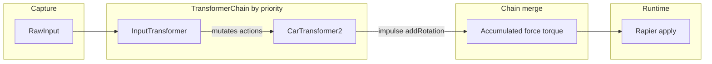

# Input transformer + Car2: paradigms and transferability

This note describes how the **`input`** and **`car2`** preset transformers work together: concrete file references, then abstract patterns you can reuse for other movement models. It reflects the current implementation (no behavior specification beyond what the code does).

**Related:** general transformer pipeline and file map — [feature-transformers.md](feature-transformers.md).

---

## End-to-end data flow

1. **`RawInput`** (keys, wheel) is sampled by the input layer and exposed to **`InputTransformer`** via a per-item `rawInputGetter` (wired in `RenderItemRegistry`).
2. **`InputTransformer`** runs early (low **`priority`**, typically `0`). It calls **`applyInputMapping`** and **replaces/merges** into **`TransformInput.actions`**. Its **`TransformOutput`** is empty — it does not apply forces.
3. **`CarTransformer2`** runs later (e.g. **`priority` `10`**). It reads **`input.actions`** by name, reads **`input.position` / `rotation` / `velocity`**, and **`input.environment`**, and returns **`impulse`** and **`addRotation`** when allowed.
4. **`TransformerChain.execute`** sorts by **`priority`**, **sums** **`force`**, **`impulse`**, and **`torque`** into accumulated **`force`** / **`torque`** vectors (so per-transformer **`impulse`** is merged into the chain’s **`force`** slot). **`addRotation`**, **`color`**, **`setPose`** are **last-wins**.
5. **`RenderItemRegistry.executeTransformers`** applies the final output to Rapier (forces/impulses/torques, rotation delta, etc.).

---

## Layer 1: `InputTransformer` (device → semantic actions)

| Aspect | Detail |
|--------|--------|
| **Role** | Map hardware state to **named scalar actions** (`Record<string, number>`). |
| **Implementation** | [src/transformers/presets/inputTransformer.ts](../src/transformers/presets/inputTransformer.ts) |
| **Mapping engine** | [src/input/inputMapping.ts](../src/input/inputMapping.ts) — keyboard keys and optional wheel axes → action names; typical values in `0..1` or signed ranges for axes. |
| **Output** | Always **`EMPTY_TRANSFORM_OUTPUT`**; side effect is **`input.actions = { ...input.actions, ...actions }`** (or `{}` if no raw input). |
| **Configuration** | Per-entity **`inputMapping`** in world JSON (`keyboard`, `wheel`, `sensitivity`). |

**Why separate from Car2:** Any controller (keyboard, future gamepad, network) can fill the same **action names**; the drive model does not hard-code keys.

---

## Layer 2: `CarTransformer2` (actions + body state → physics intent)

| Aspect | Detail |
|--------|--------|
| **Role** | Interpret **throttle / brake / steer / jump** as **impulses** and **steering rotation delta**. |
| **Implementation** | [src/transformers/presets/car2Transformer.ts](../src/transformers/presets/car2Transformer.ts) |
| **Actions consumed** | `throttle`, `brake`, `steer_left`, `steer_right`, `jump` (via **`BaseTransformer.getAction`**). |
| **Internal state** | **`wheelAngle`** (−1…1, smoothed toward zero), **`jumpHeldPrev`** (rising-edge detection for jump). |
| **Touch gating** | If **`input.environment.isTouchingObject !== true`**, returns **`{ earlyExit: false }`** with **no** **`impulse`** or **`addRotation`**. No **`color`** output in this path. |
| **Runtime fills env** | [src/runtime/renderItemRegistry.ts](../src/runtime/renderItemRegistry.ts) sets **`isTouchingObject`** from **`physicsWorld.isEntityTouchingAny`** before **`transformerChain.execute`**. |

### Behaviour summary (when touching)

- **Throttle / brake:** Impulse along body **forward** (from Euler), scaled by **`power`** and **`throttle − brake`**.
- **Lateral grip:** Opposes sideways velocity component; optional **`lateralToForwardTransfer`** redirects part of that into forward impulse.
- **Steering:** Input adjusts **`wheelAngle`** at **`steeringSpeed`**; yaw delta uses **`steeringIntensity`**, **forward speed × dt** (distance along forward), and local up — implemented as **`addRotation`**, not torque.
- **Jump:** On **rising edge** of **`jump`**, adds world **`+Y`** **`jumpImpulse`** to the impulse vector; **`jumpImpulse: 0`** disables.

### Default parameter values in code

`CarTransformer2` merges ctor params with **`DEFAULT_CAR2_PARAMS`** in the same file (`power`, `steeringIntensity`, `steeringSpeed`, `lateralGrip`, `lateralToForwardTransfer`, `jumpImpulse`). Builder defaults when **adding** a transformer come from **`getDefaultTransformerConfig('car2')`** and can differ from JSON templates (see below).

---

## Action contract: car keyboard → `input` → `car2`

Typical bindings (also **`CAR_PRESET`** in [src/input/inputPresets.ts](../src/input/inputPresets.ts) and [src/data/transformerPresets/input/keyboard-car.json](../src/data/transformerPresets/input/keyboard-car.json)):

| Key / binding | Semantic action |
|---------------|-----------------|
| W | `throttle` |
| S | `brake` |
| A | `steer_left` |
| D | `steer_right` |
| Space | `jump` |

**Adding `input` in the Builder** uses **`CAR_PRESET`** as the default mapping ([src/transformers/transformerPresets.ts](../src/transformers/transformerPresets.ts)).

---

## Two kinds of “presets”

| Layer | Where | Purpose |
|-------|--------|---------|
| **TypeScript defaults** | `getDefaultTransformerConfig`, `CAR_PRESET`, `DEFAULT_CAR2_PARAMS` | Sensible defaults when creating configs in the app or in code. |
| **JSON templates** | [src/data/transformerPresets/car2/](../src/data/transformerPresets/car2/) (`default.json`, `fast.json`), [input/keyboard-car.json](../src/data/transformerPresets/input/keyboard-car.json) | Load/save in the Builder **Templates…** dialog; same schema as entity transformer config. |

**Note:** Builder dropdown default for **`car2`** uses **`power: 1000`**; **`car2/default.json`** uses **`power: 300`** — both are valid; templates are not required to match dropdown defaults.

---

## Impulse vs chain `force` (important for reading tests and physics)

Individual transformers may set **`TransformOutput.impulse`**. The chain **adds** those components into the accumulated **`force`** vector ([src/transformers/transformer.ts](../src/transformers/transformer.ts)). Integration tests state this explicitly (**“Chain merges impulse into force”**). The runtime still has separate apply paths for **`output.force`** and **`output.impulse`**; for a typical **`input` + `car2`** chain, the merged result is usually consumed as **`force`**.

---

## Abstract paradigms (transferable)

| Paradigm | Idea |
|----------|------|
| **Separation: sensing vs execution** | One stage turns devices into **neutral action names**; the next turns actions + pose/velocity into **forces/impulses/rotation**. |
| **Named intent bus** | **`TransformInput.actions`** is a string-keyed bus. Executors use **`getAction(name)`** only — no direct keyboard checks in **`car2`**. |
| **Priority as pipeline order** | Lower **`priority`** runs first. Early stages **mutate shared input**; later stages **emit output** that the chain merges. |
| **State where it belongs** | **Input** mapping is stateless per frame (getter supplies snapshot). **Car2** keeps **short-lived behavior state** (wheel angle, edge detection). |
| **Environment gating** | The runtime publishes facts (**contacts**, wind, future ground flags). Movement code **decides** whether to apply physics without re-querying Rapier inside **`transform()`**. |
| **Dual preset layers** | Code defaults for UX + JSON libraries for sharing — same config shape. |

---

## Checklist: another vehicle or character model

1. **Define** a small **vocabulary of action names** (e.g. `throttle`, `aim_pitch`).
2. **Provide** an **`input`** transformer config (or preset) that maps **keys/wheel** to those names.
3. **Implement** a transformer that reads **`getAction`**, optional **internal state**, and **`TransformInput`** pose/velocity/environment.
4. **Emit** **`TransformOutput`** fields consistent with the chain rules (**additive** force/torque/impulse sum; know that **impulse** is merged into the chain’s **force** accumulation).
5. **Optionally** gate on **`environment`** or drive from **`target`** (see **target vs movement** in [feature-transformers.md](feature-transformers.md)).

---

## Key tests (behavior as specified in code)

- [src/transformers/presets/car2Transformer.test.ts](../src/transformers/presets/car2Transformer.test.ts) — touch gating, jump edge, lateral transfer.
- [src/transformers/presets/inputTransformer.test.ts](../src/transformers/presets/inputTransformer.test.ts) — mapping to actions.
- [src/transformers/integration.test.ts](../src/transformers/integration.test.ts) — chain merges impulse into force.
